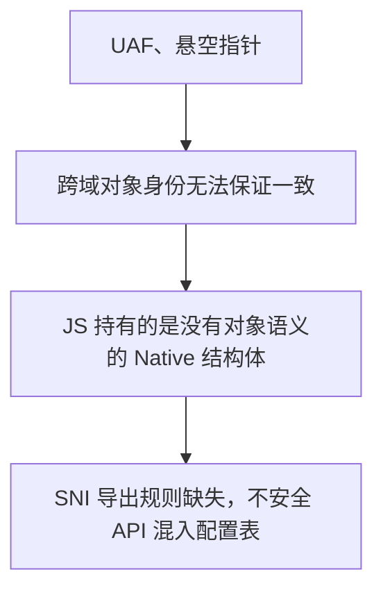

## 背景

ElenixOS 使用 JerryScript 作为应用脚本引擎，通过 SNI 向 JS 侧暴露系统能力。我们写了一套代码生成工具，可以自动把 LVGL 的 API 导出为 JS 可调用的接口。这让我们很快就在 JS 侧具备了完整的 UI 控制能力。

但很快我们就撞上了野指针问题。

## 推导

最初的表象很直接：`lv_animimg_get_anim` 返回了一个动画对象的内部指针，JS 持有该指针后出现野指针访问。

第一反应是生命周期没管好：对象被 LVGL 内部释放了，SNI 没通知 JS。顺着这个思路，我们查看了 SNI 现有的两套生命周期机制。

对象树结点（`lv.obj`、`lv.button`）通过控制块管理：控制块接管 LVGL 对象的 `user_data`，JS 对象通过 `native_ptr` 持有同一个控制块。LVGL 删除对象时触发 `LV_EVENT_DELETE`，SNI 把 `alive` 置为 `false`，后续访问直接拒掉。受控资源（`lv.timer`、`lv.style`）由 SNI 创建、持有、销毁，生命周期完全在掌握之中。

但 `lv_animimg_get_anim` 返回的指针，两条路都走不通。它不是树结点，没有 `user_data` 可以接管；也不是 SNI 创建的，不知道它什么时候销毁。这条思路到此断了：不是生命周期机制有缺陷，而是这类对象根本没有可观测的生命周期边界。

于是问题转向了所有权语义。JS 拿到原生指针后没有任何借用约束，随时可能在被 Native 释放后继续访问。听起来像是缺了一套 Borrow 模型。但很快就发现这个方向也有问题：Borrow 模型的前提是你知道对象什么时候活、什么时候死，而我们连生命周期边界都确定不了。没有生命周期信息，borrow 无从谈起。

接着开始怀疑是不是 SNI 的对象分类不够细。控制块只覆盖树结点，受控资源走链表管理，能不能再加一种 Handle 类型，专门处理这种"LVGL 内部持有、SNI 被动引用"的对象？推演了一下就发现根本困难：这种新 Handle 怎么感知对象销毁？树结点靠 `LV_EVENT_DELETE`，受控资源靠自己销毁。对于内部动画、描画任务描述符、事件描述符这类对象，LVGL 没有提供任何通用的销毁通知。加 Handle 类型只是把问题转移到了更底层：你需要一个能感知任意 LVGL 内部对象销毁的基础设施，而这在 LVGL 的架构下根本不存在。

这些路都走不通，于是开始考虑更根本的做法：干脆不让 JS 持有任何原生句柄。

在 UI 编程里，有两种基本范式。

:::note

- **命令式 UI（Imperative UI）**：开发者亲自创建、更新、销毁每一个界面对象，每一步怎么做由开发者决定。SNI 目前就属于这个范式：`new lv.obj(parent)`、`obj.setSize(100, 50)`，JS 代码直接操控原生控件。
- **声明式 UI（Declarative UI）**：开发者只描述界面长什么样，运行时引擎负责计算差异并执行实际操作，开发者不接触原生对象。React 的 JSX、Vue 的模板、SwiftUI 都属于这个范式。

:::

声明式 UI 是那条"干脆不让 JS 持有任何原生句柄"思路的自然延伸。构建一层虚拟 DOM，应用代码只描述界面结构（`<button onClick={handler}>Click</button>`），不持有任何原生对象。框架内部统一管理所有对象的创建、更新和销毁，生命周期完全由运行时引擎负责。JS 开发者只操作虚拟节点，不直接接触 `lv_obj_t *`。

这条路在架构上干净：可以说它直接把问题消灭了，而不是试图解决它。如果 JS 侧根本不持有原生指针，UAF 从何而来？

但继续往下推，发现这个思路并没有真的消灭问题。声明式框架把生命周期管理的负担从 JS 开发者转移到了引擎开发者身上：它绕开了负担，但没有消除负担。框架内部仍然需要维护虚拟 DOM 到真实控件的映射关系，仍然需要感知控件的创建和销毁、管理事件回调、处理异步场景中的一致性。在 MCU 上还得加一套 diff 引擎，引入的运行时开销和内存占用是我们不愿承担的。但更关键的是：这套机制本质上是在 C 侧重建了一套对象身份映射，与控制块做的事情一样，只是往上挪了一层。

同样的逻辑也适用于编译时方案：把 HTML/XML 或 JSX 在 PC 端编译成纯 JS 对象描述，运行时只做最小化执行。性能没问题，但工具链工作量大，且和当前命令式 API 体系差异太大。更重要的是，它在架构上绕过了同一个问题，而不是回答了它：**JS 侧能否以任何形式拿到原生对象**。

到此为止，我们开始意识到方向可能从一开始就偏了。不是因为哪个方案不够好，而是问题的前提需要重新审视。

代码生成工具本身的设计是值得肯定的。它并不是一个全自动的"语法扫描器"，而是一个配置驱动的代码生成器。它的工作方式很清晰：人工编写一份 API 表（`api_table`），在其中定义哪些类存在、哪些方法模式要导出；人工维护一份类型分类表（`lv_types.json`），标注每个 LVGL 类型属于 `handle_object`（句柄对象）、`value_object`（值对象）还是 `primitive`（基本类型）；生成器读取这两份配置，自动生成对应的 C 绑定代码。对于无法自动生成的复杂接口，也支持在配置中直接指定手工编写的封装函数来替代。

这套设计对 LVGL 控件层的工作堪称完美。`lv_obj_t`、`lv_button_t` 这类类型在 `lv_types.json` 中被标注为 `handle_object`，生成器为它们生成控制块绑定的代码。`lv_style_t`、`lv_color_t` 被标注为 `value_object`，生成器为它们生成值拷贝的代码。一切都是确定性的、可预测的。

问题不在这里。问题在于：**没有人规定过，什么有资格进入这张 API 表，什么没有。**

API 表是人工维护的，类型分类表也是人工维护的。人在填写这些配置时，没有一条明确的规则告诉他：这个函数返回的指针，JS 侧安全吗？这个类型应该标注为 handle 还是 value，还是压根不该出现在配置里？

换句话说，配置系统是完备的，但配置规范是缺失的。没有一个文档声明"SNI 只导出满足以下条件的 API"，也没有一个流程在新增配置条目时做安全性审查。每个开发者凭自己的理解往表里加东西，有些人把 `lv_animimg_get_anim` 加进了方法匹配模式里，有些人把 `lv_anim_t` 标注成了 `handle_object`。从生成器的角度看，这些都是合法的配置输入，它忠实地执行了。但没有人想过这条路径在 JS 侧是否安全。

所以真正的问题不是生成器"按语法导出"，而是：
1. 我们从未定义过 SNI 的导出边界规则。
2. 配置表在缺乏约束的情况下持续膨胀，内部指针混入了导出列表。
3. 生成器只是一个忠实执行配置的工具，它不判断、也不应该判断配置是否合理。

LVGL 是一个非常巧妙的设计。在 UI 控件层面，它用 C 语言实现了完整的面向对象风格：`lv_obj_t` 作为基类，`lv_button_t`、`lv_label_t` 通过类型转换实现继承，每个控件有构造、析构、属性读写、事件回调。这些对象具有稳定的身份（Identity）、明确的归属（Ownership）和可观测的生命周期（Observable Lifetime），下文将这三个属性统称为对象语义。在 `lv_types.json` 中把它们标注为 `handle_object`，生成器就会自动生成控制块绑定的代码，JS 侧拿到的是安全的句柄。

但 LVGL 并非所有 API 都围绕长期对象设计。LVGL 同时提供了对象 API 和过程式资源 API。控件层的 `lv_obj_create`、`lv_obj_set_size` 等具备完整的对象语义；但另一部分 API 本质上是过程式的资源管理接口，它们的入参和返回值虽然也是结构体指针，却不具备对象语义。

以 `lv_anim_t` 为例。它是一个配置结构加上一个运行时状态，不具备对象语义。创建一个 `lv_anim_t`，填充字段（duration、start_value、end_value、exec_cb），然后交给 LVGL 的动画系统。LVGL 内部持有这份数据，在定时器回调中调用 exec_cb。动画结束时，LVGL 可能释放它，也可能不释放。没有对象句柄可以查询"动画是否存活"，因为这不在它的语义之内。

另一个典型例子是 `lv_draw_task_t`。它是一个描画任务描述符而非独立对象，不具备对象语义。获取到的指针仅在当前回调中有效，它指向的是当前帧的渲染上下文，下一帧这些内存可能已被回收或复用。

这些不是 LVGL 的设计缺陷，恰恰相反，它体现了 LVGL 开发者对 C 语言的精到运用：在合适的地方用面向对象，在合适的地方用过程式 C 惯用法。UI 控件需要对象语义，所以 LVGL 给了对象语义。内部资源和执行上下文不需要，所以 LVGL 用最轻量的方式处理它们：结构体分配、按需传递、内部回收。这套混合风格是 LVGL 能在 MCU 上高效运行的重要原因。

但当 `lv_animimg_get_anim` 这样的函数被加入 API 表的导出规则时，配置系统不会拒绝它。`lv_anim_t *` 在 `lv_types.json` 里没有明确的分类，或者被顺手标成了 `handle_object`。从配置角度看完全合法，生成器也因此忠实地为它生成了控制块绑定代码，JS 侧拿到了一个句柄。问题不在生成器的逻辑里，而在配置的源头：**没有任何规则阻止这个函数进入 API 表，也没有任何检查在它进入之后发出警告。**

换句话说：不是"不该让这些对象进入 JS"，而是"在往配置表里加东西的时候，没有人问过这个 API 的返回值在 JS 侧是否安全"。UI 控件之所以运行完美，不是因为生成器聪明，而是因为它们的类型在 `lv_types.json` 中的分类恰好正确，它们的 API 在 `api_table` 中的收录恰好合理。而内部动画指针之所以出问题，是因为同样的配置表里没有一道门禁。

因此，真正的问题不是"生成器该怎么做"，而是"SNI 应该导出什么"。这是一个从未被正式定义过的边界。没有文档声明过 SNI 的导出准入规则，没有流程在配置变更时做安全性审查。生成器是一个忠实的执行器，它不判断、也不应该判断配置是否合理。判断的责任在人这里，而我们之前没有承担起来。

但这仍然没有回答一个更根本的问题：声明式 UI 强调不让 JS 持有任何原生对象，为什么这个方案初看起来是最彻底的解法？

因为它试图消灭的不是野指针，而是跨语言边界本身。如果 JS 侧只操作虚拟 DOM，不持有任何 `lv_obj_t *`，那么 identity、ownership、borrow、UAF 这些概念都不需要存在。但沿着这个思路推到尽头，会发现它并没有消灭问题，只是转移了问题的承担者。虚拟 DOM 到真实控件的映射关系、控件的创建和销毁同步、事件回调绑定的一致性：仍然需要有人来保证。这个责任从 JS 开发者转移到了 UI Runtime 引擎开发者。声明式框架在 C 侧重建了一套对象身份映射，与控制块做的事情本质相同，只是上移了一层。

继续往下推，结论会变得更清晰：只要 LVGL 运行在 C 侧，JS 运行在 JerryScript 侧，跨语言边界的对象生命周期一致性就是 SNI 不可逃避的职责。承担者可以是 JS 开发者、声明式框架或代码生成器，但职责本身无法消除。

当然，还有一种从根本上绕开这个问题的方案：放弃 LVGL，在 JS 侧实现完整的 UI 引擎，对象树、布局、渲染、事件系统全部在 JerryScript 里完成。这条路确实能彻底消除跨语言指针问题，因为根本不存在跨语言指针。但代价也很明显：在 MCU 上运行纯 JS 的 UI 引擎，对象树的构建和遍历、布局的递归计算、每帧的脏区域 diff，全部走解释执行而非原生代码。仅"实现功能等价的 LVGL"这一条就足以排除这个选项。

所以说"对象边界划错了"，不是因为不该让任何原生对象进入 JS。树结点和受控资源在 JS 环境中运行良好，因为它们的类型分类和 API 收录是合理的。而出现问题的 API（内部动画指针、事件描述符、描画任务），是因为配置表缺少对应的准入控制。

换一个视角：野指针不是生命周期管理的失败，也不是生成器的设计缺陷，而是 **SNI 导出规则缺失的后果**。如果有明确的规则定义什么能进配置表、什么不能，这些问题在写入配置的那一刻就会被阻止。

## 答案

既然问题是 SNI 导出规则的缺失，答案就很清楚了：**明确定义 SNI 的导出边界，并把它写进文档和流程里。**

具体来说，两条规则。

第一，只有具备稳定身份、明确生命周期边界、可观察销毁事件的类型，才允许进入 API 表和 `lv_types.json` 的 `handle_object` 分类。LVGL 控件层的所有对象天然满足这三个条件，保持现状。

第二，不具备上述条件的结构体（配置结构、运行时状态、内部执行上下文）不允许直接收录。对于其中确实需要向 JS 侧暴露功能的部分，走人工封装：编写封装函数，在 C 侧完成语义转换后暴露给 JS。原始结构体指针不出 C 层。

生成器不需要修改核心逻辑。它已经是一套成熟的配置驱动工具。需要的改动是：在生成器的输入端（API 表和类型分类表）增加准入审查。新增的任何配置条目，必须通过"该 API 返回的指针在 JS 侧是否安全"这一审查。

以动画为例。`lv.anim` 通过 `new` 创建，SNI 全权管理，走受控资源路径，它具备对象语义，没有问题。但 `lv_animimg_get_anim` 返回的 `lv_anim_t *` 不具备对象语义：它只是 LVGL 内部持有的一份配置和状态的组合，无法查询其存活状态，因为"查询动画是否存活"不在它的语义之内。改动方案不是想办法管理这个指针，而是不再导出这个 getter。取而代之的是一个值查询函数，在 C 侧把动画的当前值、时长、播放状态一次性读出来，打包成纯数据对象返回给 JS。JS 侧拿到的不是 LVGL 原生对象的映射，而是经过语义转换后的 UI Runtime 接口。

## 导出边界规则

一旦用生命周期的视角重新审视，导出边界规则就变得很清晰了：**JS 侧只能拿到生命周期可验证的对象，拿不到的就是不该导出的。**

这条规则把 SNI 的 handle 类型自然地分成了四类，每一类的导出策略完全不同。

**对象树节点可以自由返回。** 所有 `lv_obj_t` 及其子类（`lv_button_t`、`lv_label_t` 等）天然具备 `LV_EVENT_DELETE` 事件，控制块通过 `user_data` 接管生命周期。这个安全保障不依赖于创建者：任何一个 `lv_obj_t *`，无论是构造函数返回的还是 `lv_obj_get_parent()` 返回的，控制块都可以接管。因此对象树节点的 getter 可以安全导出。

**受控资源只能从构造函数返回。** `lv_timer_t`、`lv_style_t`、`lv_anim_t` 这类受控资源，其生命周期安全完全建立在"SNI 创建了它、跟踪它、销毁它"这个闭环上。如果允许非构造方法返回受控资源 handle，意味着 SNI 对一个未经自己创建的对象做出了它无法兑现的生命周期承诺。`lv_timer_get_next()` 遍历 LVGL 内部定时器链表，下一个 timer 可能不是 SNI 创建的；`lv_obj_get_style_anim()` 返回的动画指针来自 LVGL 内部状态，`lvgl_alive` 标记并不存在。受控资源的唯一安全出口是构造函数。

**无生命周期边界的类型永远不要进入 JS。** 像 `lv_style_value_t *`、`lv_grad_dsc_t *`、`lv_event_dsc_t *` 这类内部指针，不具备对象语义，没有销毁通知，甚至不在 LVGL 的 API 边界上停留超过一帧。把它们标注为 `handle_object` 是分类错误。正确的做法是显式标记为不导出，如果确实需要暴露功能，走手工封装，在 C 侧提取数据后以值对象返回。

**子资源可以返回，但需要覆盖两条销毁路径。** `lv_chart_series_t *`、`lv_chart_cursor_t *`、`lv_draw_buf_t *` 这类类型由父组件的方法创建（如 `lv_chart_add_series`），也可以独立销毁（如 `lv_chart_remove_series`），同时父组件删除时会被级联销毁。它们和对象树节点有一个关键区别：对象树节点只有一条销毁路径（`LV_EVENT_DELETE`），子资源有两条，即显式销毁函数和父对象的级联销毁。前者 SNI 可以拦截（在 remove 方法的特殊封装中标记 handle 失效），后者需要在父对象的 `LV_EVENT_DELETE` 回调中遍历子句柄链表统一标记失效。两条路径都被覆盖后，子资源就可以安全返回，因为它们的创建和销毁都在 SNI 视野内，当前代码仅漏接了级联销毁的路径。

这四条规则定义的是生成器自动桥接路径上的硬边界。手工封装通道始终开放：如果确实需要导出某个返回受控资源的 API（例如遍历定时器链表），开发者可以在 C 侧自行处理生命周期问题，编写手工封装函数，挂到类描述符上。生成器只在自动路径上执行规则，它不判断，也不替代人的判断，而是确保未经人工审查的受控资源不会通过自动路径进入 JS 侧。

这四条规则构成了一个完整的导出边界。它的核心逻辑只有一句话：

> SNI 只能向 JS 侧承诺它有能力兑现的安全性。对象树节点的安全性来自 LVGL 自身的销毁通知，所有人都可以信赖。受控资源的安全性来自 SNI 的创建-跟踪-销毁闭环，只有 SNI 自己能兑现，因此只有构造路径有权做这个承诺。内部描述符的安全性根本不存在，因此不应做承诺。子资源的安全性来自 SNI 覆盖两条销毁路径，创建和销毁都在视野内，两条路径全部覆盖后即可安全返回。

## 后续方向

受控资源模型已经能够可靠地处理定时器这类由 SNI 全权管理的资源。接下来的工作是将上述导出边界规则系统化：在 `lv_types.json` 中为每种 handle 类型标注其生命周期分类，在代码生成器中增加返回值类型的准入检查：受控资源非构造函数返回则拒绝，无生命周期边界类型则拒绝。同时需要修复子资源的级联销毁问题：在父对象 `LV_EVENT_DELETE` 回调中，遍历子句柄链表统一标记失效。审查现有导出表，剔除不安全的条目。

## 总结

这次推导的最终结论不是一个技术方案的选择，而是一个架构前提的修正：

> SNI 需要一份明确的导出边界规则，而不是让 API 表和类型分类表在无约束状态下持续膨胀。

LVGL 的设计是优秀的：在控件层用面向对象，在过程式接口上用 C 惯用法，这正是它在 MCU 上高效运行的关键。生成器的设计也是优秀的：配置驱动、类型分类、支持手工封装替代，它忠实地执行人的意图。问题出在它们之间的缝隙里：我们从未写过一份文档，声明哪些 API 有资格进入配置表，哪些没有。

以生命周期可验证性为标准，可以自然地为 SNI 的 handle 类型划分导出边界：对象树节点可自由返回，受控资源仅从构造方法返回，无生命周期边界类型禁止进入，子资源在两条销毁路径均被覆盖后允许返回。有了明确的边界，生成器就可以在配置阶段对不安全的导出进行拦截，而非在运行时依赖开发者的审慎。

回顾整个推导过程，一个更深层的认识逐渐浮现：代码生成器负责的是自动化，它忠实地把配置转译成代码。但它无法保证配置本身的正确性。自动生成工具可以确保"配置正确地变成代码"，但不能确保"配置本身就是正确的"。SNI 的导出边界不应由 LVGL 的类型名决定，而应由对象语义决定——当一个类型不具备稳定的身份、明确的归属和可观测的生命周期时，无论它在 C 侧的名字是什么，都不应进入 JS 侧。配置表不应成为未经设计的 API 收集器。自动化永远不能替代抽象。
