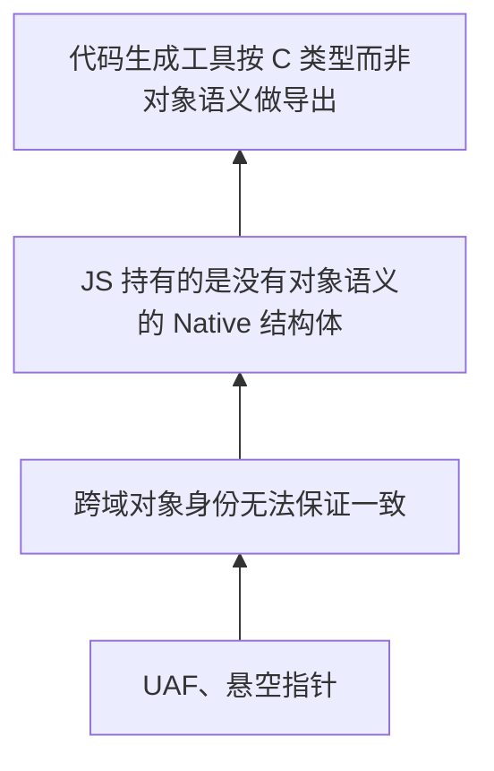

## 背景

ElenixOS 使用 JerryScript 作为应用脚本引擎，通过 SNI 向 JS 侧暴露系统能力。我们写了一套代码生成工具，可以自动把 LVGL 的 API 导出为 JS 可调用的接口。这让我们很快就在 JS 侧具备了完整的 UI 控制能力。

但很快我们就撞上了野指针问题。

## 推导

最开始看到的表象很直接：`lv_animimg_get_anim` 返回了一个动画对象的内部指针，JS 拿到后用着用着就挂了。

第一反应是生命周期没管好：对象被 LVGL 内部释放了，SNI 没通知 JS。顺着这个思路，我们查看了 SNI 现有的两套生命周期机制。

对象树结点（`lv.obj`、`lv.button`）通过控制块管理：控制块接管 LVGL 对象的 `user_data`，JS 对象通过 `native_ptr` 持有同一个控制块。LVGL 删除对象时触发 `LV_EVENT_DELETE`，SNI 把 `alive` 置为 `false`，后续访问直接拒掉。受控资源（`lv.timer`、`lv.style`）由 SNI 创建、持有、销毁，生命周期完全在掌握之中。

但 `lv_animimg_get_anim` 返回的指针，两条路都走不通。它不是树结点，没有 `user_data` 可以接管；也不是 SNI 创建的，不知道它什么时候销毁。这条思路到此断了：不是生命周期机制有缺陷，而是这类对象根本没有可观测的生命周期边界。

于是问题转向了所有权语义。JS 拿到原生指针后没有任何借用约束，随时可能在被 Native 释放后继续访问。听起来像是缺了一套 Borrow 模型。但很快就发现这个方向也有问题：Borrow 模型的前提是你知道对象什么时候活、什么时候死，而我们连生命周期边界都确定不了。没有生命周期信息，borrow 无从谈起。

接着开始怀疑是不是 SNI 的对象分类不够细。控制块只覆盖树结点，受控资源走链表管理，能不能再加一种 Handle 类型，专门处理这种"LVGL 内部持有、SNI 被动引用"的对象？推演了一下就发现根本困难：这种新 Handle 怎么感知对象销毁？树结点靠 `LV_EVENT_DELETE`，受控资源靠自己销毁。对于内部动画、描画任务描述符、事件描述符这类对象，LVGL 没有提供任何通用的销毁通知。加 Handle 类型只是把问题转移到了更底层：你需要一个能感知任意 LVGL 内部对象销毁的基础设施，而这在 LVGL 的架构下根本不存在。

这些路都走不通，于是开始考虑更根本的做法：干脆不让 JS 持有任何原生句柄。

在 UI 编程里，有两种基本范式。

:::note

- **命令式 UI（Imperative UI）**：开发者亲自创建、更新、销毁每一个界面对象，每一步怎么做由开发者决定。SNI 目前就属于这个范式：`new lv.obj(parent)`、`obj.setSize(100, 50)`，JS 代码直接操控原生控件。
- **声明式 UI（Declarative UI）**：开发者只描述界面长什么样，运行时引擎负责计算差异并执行实际操作，开发者不接触原生对象。React 的 JSX、Vue 的模板、SwiftUI 都属于这个范式。

:::

声明式 UI 是那条"干脆不让 JS 持有任何原生句柄"思路的自然延伸。构建一层虚拟 DOM，应用代码只描述界面结构（`<button onClick={handler}>Click</button>`），不持有任何原生对象。框架内部统一管理所有对象的创建、更新和销毁，生命周期完全由运行时引擎负责。JS 开发者只操作虚拟节点，不直接接触 `lv_obj_t *`。

这条路在架构上干净：可以说它直接把问题消灭了，而不是试图解决它。如果 JS 侧根本不持有原生指针，UAF 从何而来？

但继续往下推，发现这个思路并没有真的消灭问题。声明式框架把生命周期管理的负担从 JS 开发者转移到了引擎开发者身上：它绕开了负担，但没有消除负担。框架内部仍然需要维护虚拟 DOM 到真实控件的映射关系，仍然需要感知控件的创建和销毁、管理事件回调、处理异步场景中的一致性。在 MCU 上还得加一套 diff 引擎，引入的运行时开销和内存占用是我们不愿承担的。但更关键的是：这套机制本质上是在 C 侧重建了一套对象身份映射，与控制块做的事情一样，只是往上挪了一层。

同样的逻辑也适用于编译时方案：把 HTML/XML 或 JSX 在 PC 端编译成纯 JS 对象描述，运行时只做最小化执行。性能没问题，但工具链工作量大，且和当前命令式 API 体系差异太大。更重要的是，它在架构上绕过了同一个问题，而不是回答了它：**JS 侧能否以任何形式拿到原生对象**。

到此为止，我们开始意识到方向可能从一开始就偏了。不是因为哪个方案不够好，而是问题的前提需要重新审视。

代码生成工具的设计有一个隐含假设：从 LVGL 头文件中提取类型定义后，所有返回结构体指针的 API，都可以用统一的模式建模成 JS 的 Handle Object。生成器依据 C 类型（Syntax）决定导出策略：看到 `lv_xxx_t *`，就套用控制块或受控资源的模板。

这个假设的问题在于：它把 C 的类型系统当成了对象语义系统。

LVGL 是一个非常巧妙的设计。在 UI 控件层面，它用 C 语言实现了完整的面向对象风格：`lv_obj_t` 作为基类，`lv_button_t`、`lv_label_t` 通过类型转换实现继承，每个控件有构造、析构、属性读写、事件回调。这些对象有稳定的身份、明确的生命周期、可观察的删除事件，可以完美地建立跨域身份映射。代码生成工具处理这部分 API 时如鱼得水，不是因为工具写得好，而是因为 LVGL 在这里的设计本身就是面向对象的：C 类型即对象语义，生成器按语法走就是按语义走。

但不是 LVGL 的所有 API 都是面向对象的。另一部分 API 本质上是过程式的资源管理接口。它们的入参和返回值虽然也是结构体指针，但语义完全不同。

以 `lv_anim_t` 为例。它并不是一个对象。

更准确地说，它是一个配置结构加上一个运行时状态。你创建一个 `lv_anim_t`，填充它的字段（duration、start_value、end_value、exec_cb），然后把它交给 LVGL 的动画系统。LVGL 内部持有这份数据，在定时器回调中调用你的 exec_cb。动画结束时，LVGL 可能释放它，也可能不释放。你没有对象句柄可以用来查询"动画还在不在"，因为没有这个语义。

另一个典型例子是 `lv_draw_task_t`。它不是"一个可以独立存在的描画任务对象"，而是 LVGL 渲染管线内部的执行单元。你拿到它的指针，只是恰好在某个回调里看了一眼 LVGL 当前正在画的这一帧。下一帧这个指针指向什么，没有人能告诉你。

这些不是 LVGL 的设计缺陷，恰恰相反，它体现了 LVGL 开发者对 C 语言的精到运用：在合适的地方用面向对象，在合适的地方用过程式 C 惯用法。UI 控件需要对象语义，所以 LVGL 给了对象语义。内部资源和执行上下文不需要，所以 LVGL 用最轻量的方式处理它们：结构体分配、按需传递、内部回收。这套混合风格是 LVGL 能在 MCU 上高效运行的重要原因。

但代码生成工具不理解这种层次。在生成器眼里，`lv_obj_create` 返回 `lv_obj_t *`，`lv_animimg_get_anim` 返回 `lv_anim_t *`，两者都是"返回结构体指针的函数"，应该用同样的模式处理。问题就出在这里：生成器依据 C 类型（Syntax）做判断，而没有依据对象语义（Semantic）做判断。

换句话说：不是"不该让这些对象进入 JS"，而是"不该让这些结构体以原始形态进入 JS"。代码生成工具之所以能在 UI 控件上完美运行，得益于 LVGL 在控件层用 C 语言做了面向对象设计。但当它遇到 LVGL 的过程式 API 时，仍然用控件层的模板去处理，自然出问题。

因此，真正的问题不是"为什么要让这些对象成为 JS 世界里的对象"，而是"什么样的结构体具备对象语义，有资格被生成器自动映射为 JS 对象；什么样的结构体不具备，必须经过人工封装和语义转换后才能进入 JS 世界"。

但这仍然没有回答一个更根本的问题：为什么声明式 UI 这种"干脆不让 JS 持有任何原生对象"的方案，在直觉上看起来是最彻底的解法？

因为它试图消灭的不是野指针，而是跨语言边界本身。如果 JS 侧只操作虚拟 DOM，不持有任何 `lv_obj_t *`，那么 identity、ownership、borrow、UAF 这些概念都不需要存在。但沿着这个思路推到尽头，会发现它并没有消灭问题，它只是换了人买单。虚拟 DOM 到真实控件的映射关系、控件的创建和销毁同步、事件回调绑定的一致性：仍然需要有人来保证。这个"有人"从 JS 开发者变成了 UI Runtime 引擎开发者，也就是我们自己。声明式框架在 C 侧重建了一套对象身份映射，与控制块做的事情本质一样，只是往上挪了一层。

继续往下推，结论会变得更清晰：只要 LVGL 运行在 C 侧，JS 运行在 JerryScript 侧，跨语言边界的对象生命周期一致性就是 SNI 不可逃避的职责。你可以改变这个职责的承担者：交给 JS 开发者、交给声明式框架、交给代码生成器。但你不可能消除它。

当然，还有一种从根本上绕开这个问题的方案：干脆不用 LVGL，在 JS 侧实现完整的 UI 引擎：对象树、布局、渲染、事件系统全部在 JerryScript 里完成。这条路确实能彻底消灭跨语言指针的问题：因为根本没有跨语言指针。但代价也很明显：在 MCU 上跑一个纯 JS 的 UI 引擎，对象树的构建和遍历、布局的递归计算、每帧的脏区域 diff，全都走解释执行而非原生代码。工作量和性能都不用细算，仅"造一个功能等价的 LVGL"这一条就足以排除这个选项。

所以说"对象边界划错了"，不是因为不该让任何原生对象进入 JS。树结点和受控资源在 JS 世界里运行得很好，因为它们的 C 类型恰好就是对象语义，生成器按语法映射恰好就是按语义映射。而那些出问题的（内部动画指针、事件描述符、描画任务），它们的 C 类型是结构体指针，但对象语义是缺失的。生成器按语法把它们当作对象映射给了 JS，JS 拿到的却不是对象。

换一个视角：野指针不是生命周期管理的失败，而是**生成器按语法（Syntax）而非语义（Semantic）做映射的后果**。

## 答案

既然问题是生成器按语法而非语义做映射，答案就很清楚了：让代码生成工具从依据 C 类型导出，转变为依据对象语义导出。

具体来说，两条规则。

第一，只有具备完整对象语义的结构体，才允许代码生成工具自动映射为 JS 的 Handle Object。判断标准有三：有稳定身份、有明确生命周期边界、有可观察的销毁事件。LVGL 控件层的所有对象天然满足这三个条件，继续交给生成器自动处理。

第二，不具备对象语义的结构体：配置结构、运行时状态、内部执行上下文：不进入自动生成通道。对于其中确实需要向 JS 侧暴露功能的部分，走人工封装。封装函数在 C 侧完成语义转换：把过程式的结构体操作，转化为 JS 侧可以安全消费的值对象或纯函数调用。原始结构体指针不出 C 层，JS 侧拿到的不是 `lv_anim_t *` 的薄包装，而是经过专项优化的、面向 JS UI Runtime 的接口。

以动画为例。`lv.anim` 通过 `new` 创建，SNI 全权管理，走受控资源路径，它具备对象语义，没有问题。但 `lv_animimg_get_anim` 返回的 `lv_anim_t *` 不具备对象语义：它只是 LVGL 内部持有的一份配置和状态的组合，你无法查询它的存活状态，因为"查询动画是否存活"不是它的语义的一部分。改动方案不是想办法管理这个指针，而是不再导出这个 getter。取而代之的是一个值查询函数，在 C 侧把动画的当前值、时长、播放状态一次性读出来，打包成纯数据对象返回给 JS。JS 侧拿到的不是 LVGL 原生对象的映射，而是经过语义转换后的 UI Runtime 接口。

## 后续方向

受控资源模型处理定时器这类具备对象语义的资源已经很可靠。动画这类不具备对象语义的内部结构体，目前的答案是不进入自动生成管线，靠人工封装在边界处完成语义转换。

如果未来这类场景变多，可以考虑把对象语义的类型划分系统化为固定的标记体系，由人工标注每个 C 类型属于对象还是结构体，生成器根据标记决定处理策略。但目前规模下，手动审查就够了。

## 总结

这次推导的最终结论不是一个技术方案的选择，而是一个架构前提的修正：

> 代码生成工具应当依据对象语义（Semantic）生成，而不是依据 C 类型（Syntax）生成。

LVGL 在控件层用 C 语言实现了完整的面向对象设计，C 类型即对象语义，所以生成器在这一层按语法走就是按语义走，完美运行。但 LVGL 的另一部分 API 是过程式的资源管理接口，结构体指针不等于对象语义。生成器在这里按语法走就走错了。

问题在我们这一侧：我们不应该要求 LVGL 的所有 API 都符合对象语义，而应该在 SNI 的边界处承担起语义转换的职责。

如果未来需要降低开发门槛、提供更接近 Web 的体验，可以在现有 SNI 之上做声明式封装。那是锦上添花，而不是补漏洞。因为在那之前，先划定哪些是对象、哪些只是结构体，让生成器在它擅长的领域继续高效工作，把不擅长的留给人工判断，比什么都重要。
