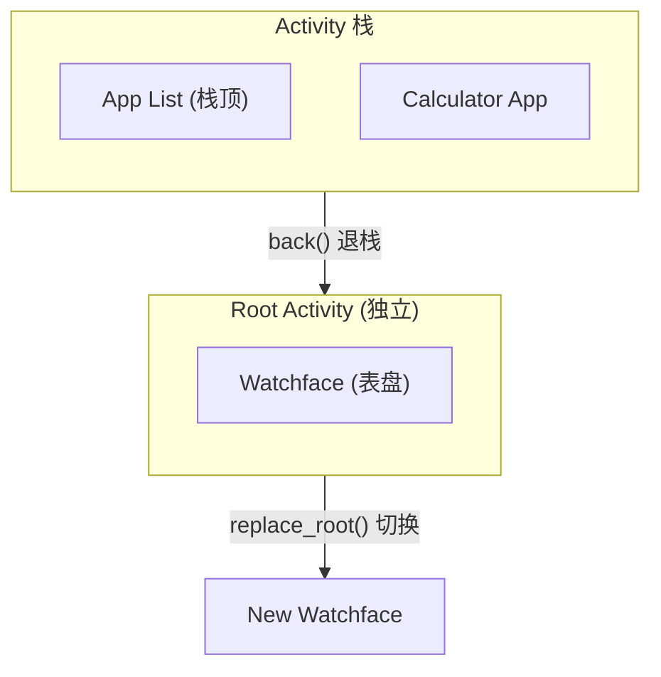

# Activity 与 View

Activity 是 ElenixOS 中管理页面和用户界面的核心组件。每个 Activity 代表一个独立的屏幕页面（如应用页面、表盘页面），包含与之关联的 View（视图）以及完整的生命周期管理。

## Activity 概述

Activity 是 ElenixOS 页面导航和生命周期管理的核心抽象。每个 Activity 包含：

- 一个关联的 **View**（LVGL 对象树），即页面的 UI 内容
- 完整的 **生命周期回调**（进入、销毁、暂停、恢复）
- **标题** 和 **标题颜色** 等 UI 属性
- **类型** 标识（应用、表盘、应用列表等）
- **AppHeader** 可见性控制

### Activity 类型

```c
typedef enum {
    EOS_ACTIVITY_TYPE_NULL = 0,            // 空类型
    EOS_ACTIVITY_TYPE_APP,                 // 应用页面
    EOS_ACTIVITY_TYPE_APP_LIST,            // 应用列表
    EOS_ACTIVITY_TYPE_WATCHFACE,           // 表盘页面
    EOS_ACTIVITY_TYPE_WATCHFACE_LIST,      // 表盘列表
    EOS_ACTIVITY_TYPE_COUNT
} eos_activity_type_t;
```

## 生命周期

Activity 拥有完整的生命周期，由以下回调函数管理：

```c
typedef struct {
    eos_activity_on_enter_t on_enter;      // 进入时调用
    eos_activity_on_destroy_t on_destroy;  // 销毁时调用
    eos_activity_on_pause_t on_pause;      // 暂停时调用
    eos_activity_on_resume_t on_resume;    // 恢复时调用
} eos_activity_lifecycle_t;
```

### 生命周期流程

```
创建 Activity (eos_activity_create)
    │
    ▼
进入 Activity (eos_activity_enter)
    │
    ├── on_enter()  ── 进入回调
    │
    ▼
Activity 可见 (visible)
    │
    ├── on_resume()  ── 恢复回调（从其他 Activity 返回时）
    │
    ▼
离开 Activity
    │
    ├── on_pause()  ── 暂停回调（切换到其他 Activity 时）
    │
    ▼
返回 Activity ──► on_resume()
    │
    ▼
销毁 Activity (eos_activity_back)
    │
    └── on_destroy() ── 销毁回调
```

### 生命周期回调说明

| 回调 | 触发时机 | 典型用途 |
|------|----------|----------|
| `on_enter` | Activity 首次显示时 | 初始化 UI、加载数据 |
| `on_resume` | 从其他 Activity 返回时 | 刷新数据、恢复动画 |
| `on_pause` | 切换到其他 Activity 时 | 保存状态、暂停动画 |
| `on_destroy` | Activity 被销毁时 | 释放资源、取消订阅 |

## Activity 栈管理

ElenixOS 使用栈结构管理 Activity。栈底固定为表盘（Watchface）Activity，新打开的 Activity 被压入栈顶。

### Root Activity 机制

**重要概念**：表盘作为 **Root Activity**（根活动），独立于 Activity 栈管理，具有特殊地位：



**Root Activity 特性**：

| 特性 | 普通 Activity | Root Activity |
|------|--------------|---------------|
| **位置** | 在栈中 | 独立于栈外 |
| **生命周期** | 随入栈/退栈创建销毁 | 持久存在直到切换 |
| **创建方式** | `eos_activity_create()` | `eos_activity_create_root()` |
| **View 创建** | 延迟创建（on_enter 中） | **立即创建**（create_root 时） |
| **退栈影响** | 销毁并释放 | 不受退栈影响 |
| **切换方式** | N/A | `eos_activity_replace_root()` |

**Root Activity 使用场景**：
- 表盘（内建或 JS）
- 作为系统的"首页"，始终存在
- 切换时通过 `replace_root()` 替换，而非入栈/退栈

### 栈结构示意

```
栈顶
      ┌──────────────────┐
      │  Activity C      │  ← 当前可见的 Activity
      ├──────────────────┤
      │  Activity B      │  ← 暂停状态
      ├──────────────────┤
      │  Activity A      │  ← 暂停状态
      └──────────────────┘
           │
           │ (独立于栈)
           ▼
     ┌─────────────┐
     │  Watchface  │  ← Root Activity (始终存在)
     └─────────────┘
```

### 导航操作

#### 进入新 Activity

```c
eos_activity_enter(activity);
```

将 Activity 压入栈顶并显示。之前的 Activity 自动进入暂停状态。

#### 返回上一 Activity

```c
eos_result_t ret = eos_activity_back();
```

销毁当前栈顶 Activity，恢复上一 Activity。返回 `EOS_OK` 表示成功。

#### 返回表盘

```c
eos_result_t ret = eos_activity_back_to_watchface();
```

销毁所有栈中 Activity，直接返回表盘。

#### 事件回调中返回

```c
void eos_activity_back_cb(lv_event_t *e);
```

在 LVGL 事件回调中使用的便捷封装。

## 接口职责与使用边界

Activity 接口分为四组：控制器初始化与 Root 管理、普通 Activity 创建与销毁、当前页面和过渡状态查询、View/标题/AppHeader/快照属性管理。它们操作的是 Activity 控制器拥有的对象，不改变 SPM 程序和 SNI 资源的所有权。

Root Activity 的创建会立即建立 View；普通 Activity 通常在进入生命周期中绑定 View。显式销毁只适用于不在栈中的临时 Activity。当前页面、已完成显示的页面和过渡中的页面必须通过不同的查询语义区分，不能用一个“当前指针”代替所有状态。

Activity 类型用于选择页面过渡和识别页面用途；标题、AppHeader 和快照属于页面表现属性。快照可以服务于页面过渡或 Recent Apps，但快照缓冲区不拥有 Activity View。过渡回调使用动画组协调多个对象，完成和清理由动画组统一管理。

应用开发只需要依赖文档生成的接口参考来确认具体签名；本页只规定调用时机、对象所有权、生命周期限制和错误边界。

## View 与 AppHeader 的使用边界

View 是 Activity 拥有的 LVGL 对象树根。页面进入时建立并绑定 View，页面销毁时由 Activity 生命周期统一释放。页面代码可以使用 LVGL 完成布局，但不应替换控制器正在持有的 View，也不应在页面离开时自行删除仍归 Activity 管理的对象。

AppHeader 是系统统一管理的页面头部。它的显示状态、标题和过渡应通过 Activity 属性与系统头部管理器协作；页面不应直接改变顶层 Overlay 的 Z-order。标题栏与页面内容应在同一页面状态切换中完成更新。

应用开发的具体函数签名、参数和返回值由自动生成的 API 参考提供。本页只记录 View 的所有权、AppHeader 的层级关系、进入/离开时机以及页面过渡中的限制。

## Activity 与事件系统

Activity 系统与[事件系统](/docs/architecture/kernel/event/events)紧密集成。当 Activity 页面切换完成时，会广播 `EOS_EVENT_ACTIVITY_SCREEN_SWITCHED` 事件：

```c
// 监听页面切换完成事件
eos_event_add_cb(some_obj, my_cb, EOS_EVENT_ACTIVITY_SCREEN_SWITCHED, NULL);

static void my_cb(lv_event_t *e) {
    lv_obj_t *current_view = lv_event_get_param(e);
    // 页面切换完成，current_view 为当前页面的 View
}
```

## Activity 系统初始化流程

```
系统启动
    │
    ▼
eos_activity_controller_init(watchface_activity)
    │
    ├── 创建 Activity 栈
    ├── 获取根屏幕
    ├── 将表盘 Activity 设为当前
    └── 调用 on_enter()
    │
    ▼
eos_app_header_init()
    │
    ├── 创建 AppHeader UI
    └── 放置在 lv_layer_top() 层
    │
    ▼
系统运行
```

## 错误处理

| 情况 | 返回值 |
|------|--------|
| Activity 控制器未初始化 | 函数返回 `EOS_FAILED` |
| 传入 NULL Activity | 函数内部检查并直接返回 |
| Activity 栈为空 | `eos_activity_get_current` 返回 NULL |
| 过渡动画进行中 | `eos_activity_is_transition_in_progress` 返回 true |

## 当前 Activity 接口边界

### 创建与销毁

- `eos_activity_create` 创建普通 Activity，View 通常在 `on_enter` 中绑定。
- `eos_activity_create_root` 创建 Root Activity，并立即建立 View，适用于表盘。
- `eos_activity_destroy` 只用于不在 Activity 栈中的 Activity；不能用于当前可见、栈内或已停放的 Activity。
- 控制器初始化接收 Root Activity；Root Activity 不会被普通返回操作销毁。

### 查询接口

页面查询接口用于区分导航上下文。过渡期间不要把当前导航对象当成已经完成显示的页面；需要判断动画状态时应使用专门的过渡状态查询。

### View、标题和动画

View 读取和绑定只应在生命周期允许的阶段进行。标题、标题颜色、页面类型和 AppHeader 可见性都属于 Activity 属性。页面过渡回调接收动画组，多个相关动画应加入同一动画组，由组统一完成和清理。

## Recent Apps 中的 Activity 子栈

挂起时，应用 Root Activity 及其子 Activity 从当前栈分离，View 移入不可见 Parking Lot；Activity 对象和 View 仍然有效。恢复时重新附加保存的子栈，更新可见 Activity，再进行快照过渡。

因此 `on_pause` 表示暂时不可见，不表示资源已经失效；`on_destroy` 才表示 Activity 不会再恢复。App Activity 的包 ID必须稳定，以便 Recent Apps、卸载和引擎复位清理可以找到对应对象。
