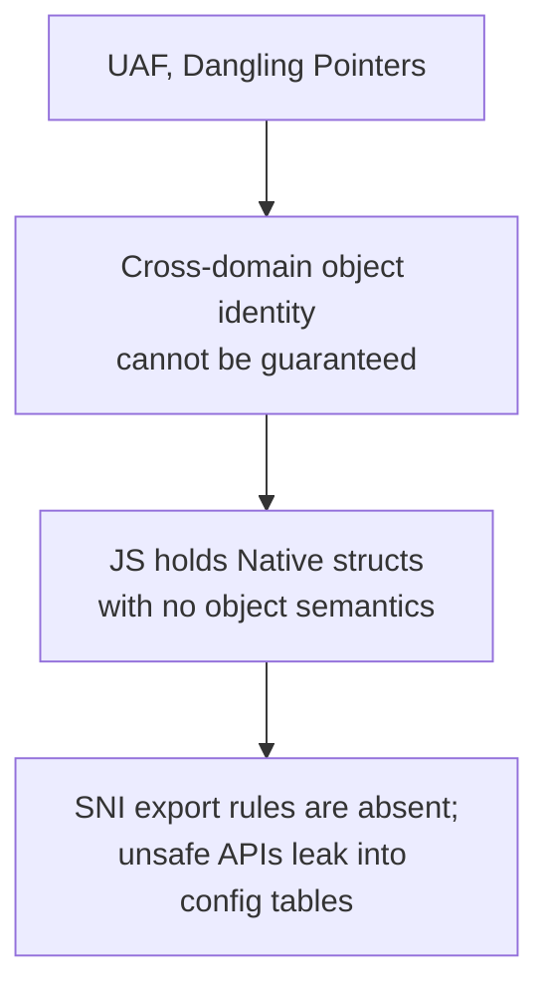

## Background

ElenixOS uses JerryScript as its application script engine, exposing system capabilities to the JS side through SNI (Script Native Interface). We built a code generation tool that automatically exports LVGL's API as JS-callable interfaces. This quickly gave us full UI control on the JS side—creating widgets, setting properties, registering events, all directly callable.

But soon we hit the wild pointer problem.

## The Derivation

The initial symptom was straightforward: `lv_animimg_get_anim` returned an internal pointer to an animation object, and the JS side crashed upon using it.

The first reaction was that we hadn't managed the lifecycle properly—the object was freed internally by LVGL without SNI notifying JS. Following this line of thought, we examined SNI's two existing lifecycle mechanisms.

Object tree nodes (`lv.obj`, `lv.button`) are managed through control blocks: the control block takes over the `user_data` field of the LVGL object, and the JS object holds the same control block through `native_ptr`. When LVGL deletes an object, it triggers `LV_EVENT_DELETE`, and SNI sets `alive` to `false`, rejecting all subsequent access. Managed resources (`lv.timer`, `lv.style`) are created, held, and destroyed by SNI—their lifecycle is fully under control.

But the pointer returned by `lv_animimg_get_anim` fits neither path. It is not a tree node, so there is no `user_data` to take over; nor was it created by SNI, so we don't know when it will be destroyed. This line of inquiry stopped here—it wasn't that the lifecycle mechanism had a flaw, but that such objects simply have no observable lifecycle boundary.

The problem then shifted to ownership semantics. The JS side held a raw pointer with no borrowing constraints, and could access it at any moment after Native had freed it. It sounded like we were missing a Borrow model. But we quickly saw the problem: a Borrow model requires knowing when an object lives and dies, and we couldn't even determine the lifecycle boundary. Without lifecycle information, borrowing is meaningless.

Then we began to suspect that SNI's object classification wasn't granular enough. Control blocks only cover tree nodes, and managed resources use linked lists. Could we add another Handle type specifically for objects that are "held internally by LVGL and passively referenced by SNI"? We ran the thought experiment and hit a fundamental difficulty: how would this new Handle detect object destruction? Tree nodes rely on `LV_EVENT_DELETE`, and managed resources are destroyed by SNI itself. For internal animations, draw task descriptors, event descriptors, and similar objects, LVGL provides no universal destruction notification. Adding a Handle type merely shifts the problem downward—you would need infrastructure capable of sensing the destruction of any arbitrary LVGL internal object, and such infrastructure simply does not exist within LVGL's architecture.

None of these paths led anywhere, so we began considering a more radical approach: don't let JS hold any native handles at all.

There are two fundamental paradigms in UI programming.

:::note

- **Imperative UI**: The developer manually creates, updates, and destroys every interface object, deciding each step themselves. SNI currently belongs to this paradigm: `new lv.obj(parent)`, then `obj.setSize(100, 50)`—JS code directly manipulates native widgets.
- **Declarative UI**: The developer only describes what the UI should look like, and the runtime engine computes the differences and performs the actual operations. The developer never touches native objects. React's JSX, Vue's templates, and SwiftUI all belong to this paradigm.

:::

Declarative UI is a natural extension of the "don't let JS hold any native handles" idea. Build a virtual DOM layer where application code only describes the interface structure (`<button onClick={handler}>Click</button>`), holding no native objects. The framework internally manages all object creation, updates, and destruction, with lifecycle entirely handled by the runtime engine. JS developers only manipulate virtual nodes, never touching `lv_obj_t *` directly.

Architecturally, this approach is clean—you could say it eliminates the problem rather than solving it. If the JS side holds no native pointers at all, where does UAF come from?

But push further and you realize this approach hasn't truly eliminated the problem. A declarative framework shifts the lifecycle management burden from JS developers to the engine developers—it sidesteps the burden, but doesn't eliminate it. The framework must still maintain mappings from virtual DOM to real widgets, synchronize widget creation and destruction, manage event callback bindings, and handle consistency in async scenarios. On an MCU, you also need a diff engine, introducing runtime overhead and memory usage we're unwilling to shoulder. But more critically: this mechanism essentially rebuilds an object identity mapping on the C side—the same thing the control block does, just one layer up.

The same logic applies to compile-time solutions: compile HTML/XML or JSX on the PC side into pure JS object descriptions, with only minimal execution at runtime. Performance is fine, but the toolchain workload is substantial, and it diverges too much from our current imperative API approach. More importantly, architecturally it sidesteps the same question rather than answering it: **can the JS side hold native objects in any form?**

At this point we began to realize the direction might have been wrong from the start. Not because any particular solution was inadequate, but because the premise itself needed reexamination.

The code generation tool itself deserves recognition. It is not a fully-automatic "syntax scanner" — it is a config-driven code generator. Its workflow is straightforward: a human writes an API table (`api_table`) defining which classes exist and which method patterns to export; a human maintains a type classification table (`lv_types.json`) annotating each LVGL type as `handle_object`, `value_object`, or `primitive`; the generator reads these two configs and automatically produces the corresponding C binding code. For complex interfaces that cannot be auto-generated, it also supports specifying hand-written wrapper functions directly in the config.

This design works flawlessly for the LVGL widget layer. Types like `lv_obj_t` and `lv_button_t` are annotated as `handle_object` in `lv_types.json` — the generator produces control block binding code. Types like `lv_style_t` and `lv_color_t` are annotated as `value_object` — the generator produces value-copy code. Everything is deterministic and predictable.

The problem lies elsewhere: **no one ever defined what qualifies for inclusion in this API table, and what doesn't.**

The API table is human-maintained, and so is the type classification table. When a person fills in these configs, there is no explicit rule telling them: is the pointer returned by this function safe for the JS side? Should this type be annotated as handle or value, or should it never appear in the config at all?

In other words, the config system is complete, but the config specification is missing. No document declares "SNI only exports APIs satisfying the following criteria." No process performs a safety review when new entries are added. Each developer adds things to the table based on their own understanding. Someone added `lv_animimg_get_anim` to a method matching pattern. Someone annotated `lv_anim_t` as `handle_object` — from the generator's perspective, these are perfectly valid config inputs, and it faithfully executes them. But no one ever asked whether this path is safe on the JS side.

So the real problem isn't that the generator "exports by syntax." It's that:
1. We never defined SNI's export boundary rules.
2. The config tables swelled without constraints, and internal pointers leaked into the export list.
3. The generator is merely a faithful executor of config — it doesn't, and shouldn't, judge whether the config is reasonable.

LVGL is a remarkably clever design. At the UI widget level, it implements a complete object-oriented style in C: `lv_obj_t` as the base class, `lv_button_t` and `lv_label_t` implementing inheritance through type casting. Each widget has construction, destruction, property access, and event callbacks. These objects have stable identity, clear lifecycle boundaries, and observable destruction events—they can perfectly establish cross-domain identity mapping. Annotate them as `handle_object` in `lv_types.json`, and the generator automatically produces control block binding code. The JS side receives a safe handle.

But not all of LVGL's APIs are object-oriented. Another portion of the API is fundamentally procedural resource management interfaces. Their parameters and return values are also struct pointers, but with entirely different semantics.

Take `lv_anim_t` as an example. It is not an object.

More precisely, it is a configuration structure plus runtime state. You create an `lv_anim_t`, fill its fields (duration, start_value, end_value, exec_cb), and hand it to LVGL's animation system. LVGL internally holds this data and calls your exec_cb in a timer callback. When the animation ends, LVGL may or may not free it. You have no object handle to query "is the animation still alive?" because that's not part of its semantics.

Another typical example is `lv_draw_task_t`. It is not "an independently existing draw task object," but an execution unit internal to LVGL's rendering pipeline. Getting its pointer means you happened to glance at what LVGL is currently drawing in that frame, inside some callback. What the pointer points to in the next frame—no one can tell you.

These are not design flaws in LVGL. Quite the contrary, they demonstrate the LVGL developers' masterful use of C: object-oriented where appropriate, procedural C idioms where appropriate. UI widgets need object semantics, so LVGL gives them object semantics. Internal resources and execution contexts don't, so LVGL handles them in the lightest way possible: struct allocation, pass-by-reference, internal reclamation. This hybrid style is a key reason LVGL runs efficiently on MCUs.

But when a function like `lv_animimg_get_anim` gets added to the API table's export rules, the config system doesn't reject it. `lv_anim_t *` either lacks a classification in `lv_types.json`, or was casually annotated as `handle_object` — perfectly legal from a config perspective. The generator faithfully produces control block binding code for it, and the JS side receives a handle. The problem isn't in the generator's logic, but at the source of the config: **no rule prevents this function from entering the API table, and no check issues a warning after it enters.**

In other words: it's not that "these objects shouldn't enter JS," but that "no one asks whether this API's return value is safe for JS when adding it to the config table." UI widgets work perfectly not because the generator is smart, but because their types are correctly classified in `lv_types.json` and their APIs are reasonably included in `api_table`. Internal animation pointers fail because the same config table has no access control.

Thus, the real question is not "what should the generator do," but "what should SNI export" — a boundary that has never been formally defined. No document declares SNI's export admission rules. No process performs safety review on config changes. The generator is a faithful executor — it doesn't, and shouldn't, judge whether the config is reasonable. The responsibility for judgment lies with us, and we hadn't shouldered it before.

But this still doesn't answer a more fundamental question: why does the declarative UI approach—"don't let JS hold any native objects at all"—feel intuitively like the most thorough solution?

Because what it tries to eliminate is not wild pointers, but the cross-language boundary itself. If the JS side only manipulates virtual DOM, holding no `lv_obj_t *` at all, then concepts like identity, ownership, borrowing, and UAF don't need to exist. But follow this line of thought to its end, and you'll find it hasn't eliminated the problem—it has only shifted who pays the bill. The mapping from virtual DOM to real widgets, synchronization of widget creation and destruction, and consistency of event callback bindings: someone still needs to guarantee these. That "someone" shifts from JS developers to the UI Runtime engine developers—i.e., ourselves. A declarative framework rebuilds an object identity mapping on the C side, essentially doing the same thing as the control block, just one layer up.

Pushing further, the conclusion becomes clearer: as long as LVGL runs on the C side and JS runs on the JerryScript side, cross-language object lifecycle consistency is SNI's inescapable responsibility. You can change who bears this responsibility—give it to JS developers, to a declarative framework, to the code generator—but you can't eliminate it.

There is, of course, a way to bypass the problem entirely: abandon LVGL and implement a complete UI engine on the JS side—object tree, layout, rendering, event system all within JerryScript. This path genuinely eliminates the cross-language pointer problem, because there are no cross-language pointers. But the cost is clear: running a pure-JS UI engine on an MCU means object tree construction and traversal, recursive layout calculation, per-frame dirty region diffing—all interpreted rather than native. The workload and performance don't need detailed calculation; the single item "build a functionally equivalent LVGL" is enough to disqualify this option.

So "the object boundary was drawn wrong" isn't about whether any native object should enter JS at all. Tree nodes and managed resources work perfectly in the JS world because their type classification and API inclusion are reasonable. The problematic ones (internal animation pointers, event descriptors, draw tasks) fail because the config table lacks an access gate to block them.

A different perspective: wild pointers are not a failure of lifecycle management, nor a design flaw in the generator, but **the consequence of absent SNI export boundary rules**. If clear rules had defined what can and cannot enter the config table, these problems would have been stopped the moment they were written into the config.

## The Answer

Since the problem is the absence of SNI export boundary rules, the answer is clear: **formally define SNI's export boundaries, and encode them into documentation and process.**

Specifically, two rules.

First, only types with stable identity, clear lifecycle boundaries, and observable destruction events qualify for inclusion in the API table and classification as `handle_object` in `lv_types.json`. All LVGL widget-layer objects naturally satisfy these three conditions — keep as-is.

Second, structs that fail these criteria — configuration structures, runtime state, internal execution contexts — are not allowed to be directly included. For those that genuinely need to expose functionality to JS, go through manual encapsulation: write hand-crafted wrapper functions that perform semantic transformation on the C side before exposing to JS. Raw struct pointers never cross the C layer.

The generator's core logic doesn't need modification. It is already a mature config-driven tool. What needs to change is what sits upstream of it: the API table and type classification table need a layer of admission review. Every new config entry must pass the check: "is the pointer returned by this API safe for the JS side?"

Take animation as an example. `lv.anim` is created via `new`, fully managed by SNI through the managed resource path—it is correctly configured, no problem. But `lv_animimg_get_anim` should never have been admitted into the API table's export rules. Once removed and routed through a manual wrapper — a value query function that reads out the animation's current value, duration, and playback state on the C side, packaging them as a pure data object — the JS side never touches a raw `lv_anim_t *`.

## Future Directions

The managed resource model handles resources like timers that are fully owned by SNI — already reliable. For internal structs like animation internals, the current answer is to keep them out of the API table, routing them through manual wrappers when needed.

If these scenarios become more common, we could systematize the admission review process: every new API table entry must be accompanied by a lifecycle attribution and JS-side safety assessment. But at the current scale, manual review is sufficient.

## Summary

The final conclusion of this derivation is not a choice of technical solutions, but a correction of an architectural premise:

> SNI needs an explicit export boundary specification — the API table and type classification table cannot be allowed to swell without constraints.

LVGL's design is excellent: object-oriented at the widget layer, procedural C idioms in the resource interfaces — precisely what makes it efficient on MCUs. The generator's design is also excellent: config-driven, type-classified, with manual wrapper alternatives — it faithfully executes human intent. The problem lies in the gap between them: we never wrote a document declaring which APIs qualify for the config table, and which don't.

With clear rules in place, audit the existing `api_table` and `lv_types.json`, remove unsafe entries, and what remains is a reliable config. The generator continues doing what it does best: read config, generate code. It doesn't need to become smarter — we need to become clearer.

If we need to lower the development barrier and provide a more web-like experience in the future, we can build declarative wrappers on top of the existing SNI. That would be the icing on the cake, not a patch for a leak. Because before that, writing down SNI's export boundaries matters more than adding any new system mechanism.
