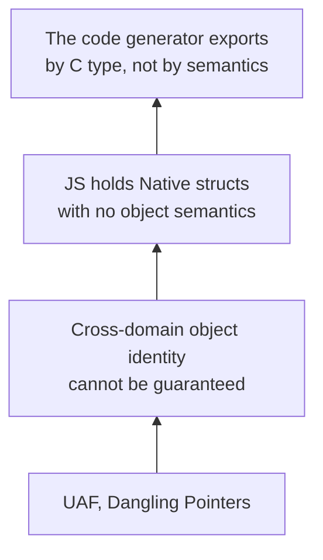

## Background

ElenixOS uses JerryScript as its application script engine, exposing system capabilities to the JS side through SNI (Script Native Interface). We built a code generation tool that automatically exports LVGL's API as JS-callable interfaces. This quickly gave us full UI control on the JS side—creating widgets, setting properties, registering events, all directly callable.

But soon we hit the wild pointer problem.

## The Derivation

The initial symptom was straightforward: `lv_animimg_get_anim` returned an internal pointer to an animation object, and the JS side crashed upon using it.

The first reaction was that we hadn't managed the lifecycle properly—the object was freed internally by LVGL without SNI notifying JS. Following this line of thought, we examined SNI's two existing lifecycle mechanisms.

Object tree nodes (`lv.obj`, `lv.button`) are managed through control blocks: the control block takes over the `user_data` field of the LVGL object, and the JS object holds the same control block through `native_ptr`. When LVGL deletes an object, it triggers `LV_EVENT_DELETE`, and SNI sets `alive` to `false`, rejecting all subsequent access. Managed resources (`lv.timer`, `lv.style`) are created, held, and destroyed by SNI—their lifecycle is fully under control.

But the pointer returned by `lv_animimg_get_anim` fits neither path. It is not a tree node, so there is no `user_data` to take over; nor was it created by SNI, so we don't know when it will be destroyed. This line of inquiry stopped here—it wasn't that the lifecycle mechanism had a flaw, but that such objects simply have no observable lifecycle boundary.

The problem then shifted to ownership semantics. The JS side held a raw pointer with no borrowing constraints, and could access it at any moment after Native had freed it. It sounded like we were missing a Borrow model. But we quickly saw the problem: a Borrow model requires knowing when an object lives and dies, and we couldn't even determine the lifecycle boundary. Without lifecycle information, borrowing is meaningless.

Then we began to suspect that SNI's object classification wasn't granular enough. Control blocks only cover tree nodes, and managed resources use linked lists. Could we add another Handle type specifically for objects that are "held internally by LVGL and passively referenced by SNI"? We ran the thought experiment and hit a fundamental difficulty: how would this new Handle detect object destruction? Tree nodes rely on `LV_EVENT_DELETE`, and managed resources are destroyed by SNI itself. For internal animations, draw task descriptors, event descriptors, and similar objects, LVGL provides no universal destruction notification. Adding a Handle type merely shifts the problem downward—you would need infrastructure capable of sensing the destruction of any arbitrary LVGL internal object, and such infrastructure simply does not exist within LVGL's architecture.

None of these paths led anywhere, so we began considering a more radical approach: don't let JS hold any native handles at all.

There are two fundamental paradigms in UI programming.

:::note

- **Imperative UI**: The developer manually creates, updates, and destroys every interface object, deciding each step themselves. SNI currently belongs to this paradigm: `new lv.obj(parent)`, then `obj.setSize(100, 50)`—JS code directly manipulates native widgets.
- **Declarative UI**: The developer only describes what the UI should look like, and the runtime engine computes the differences and performs the actual operations. The developer never touches native objects. React's JSX, Vue's templates, and SwiftUI all belong to this paradigm.

:::

Declarative UI is a natural extension of the "don't let JS hold any native handles" idea. Build a virtual DOM layer where application code only describes the interface structure (`<button onClick={handler}>Click</button>`), holding no native objects. The framework internally manages all object creation, updates, and destruction, with lifecycle entirely handled by the runtime engine. JS developers only manipulate virtual nodes, never touching `lv_obj_t *` directly.

Architecturally, this approach is clean—you could say it eliminates the problem rather than solving it. If the JS side holds no native pointers at all, where does UAF come from?

But push further and you realize this approach hasn't truly eliminated the problem. A declarative framework shifts the lifecycle management burden from JS developers to the engine developers—it sidesteps the burden, but doesn't eliminate it. The framework must still maintain mappings from virtual DOM to real widgets, synchronize widget creation and destruction, manage event callback bindings, and handle consistency in async scenarios. On an MCU, you also need a diff engine, introducing runtime overhead and memory usage we're unwilling to shoulder. But more critically: this mechanism essentially rebuilds an object identity mapping on the C side—the same thing the control block does, just one layer up.

The same logic applies to compile-time solutions: compile HTML/XML or JSX on the PC side into pure JS object descriptions, with only minimal execution at runtime. Performance is fine, but the toolchain workload is substantial, and it diverges too much from our current imperative API approach. More importantly, architecturally it sidesteps the same question rather than answering it: **can the JS side hold native objects in any form?**

At this point we began to realize the direction might have been wrong from the start. Not because any particular solution was inadequate, but because the premise itself needed reexamination.

The code generation tool was built on an implicit assumption: after extracting type definitions from LVGL headers, all APIs returning struct pointers can be modeled as JS Handle Objects using a unified pattern. The generator decides its export strategy based on C type (Syntax): see `lv_xxx_t *`, apply the control block or managed resource template.

The problem with this assumption: it treats the C type system as an object semantic system.

LVGL is a remarkably clever design. At the UI widget level, it implements a complete object-oriented style in C: `lv_obj_t` as the base class, `lv_button_t` and `lv_label_t` implementing inheritance through type casting. Each widget has construction, destruction, property access, and event callbacks. These objects have stable identity, clear lifecycle boundaries, and observable destruction events—they can perfectly establish cross-domain identity mapping. The code generation tool handles these APIs effortlessly, not because the tool is well-written, but because LVGL's design here is inherently object-oriented: C type equals object semantics, and the generator follows syntax which happens to follow semantics.

But not all of LVGL's APIs are object-oriented. Another portion of the API is fundamentally procedural resource management interfaces. Their parameters and return values are also struct pointers, but with entirely different semantics.

Take `lv_anim_t` as an example. It is not an object.

More precisely, it is a configuration structure plus runtime state. You create an `lv_anim_t`, fill its fields (duration, start_value, end_value, exec_cb), and hand it to LVGL's animation system. LVGL internally holds this data and calls your exec_cb in a timer callback. When the animation ends, LVGL may or may not free it. You have no object handle to query "is the animation still alive?" because that's not part of its semantics.

Another typical example is `lv_draw_task_t`. It is not "an independently existing draw task object," but an execution unit internal to LVGL's rendering pipeline. Getting its pointer means you happened to glance at what LVGL is currently drawing in that frame, inside some callback. What the pointer points to in the next frame—no one can tell you.

These are not design flaws in LVGL. Quite the contrary, they demonstrate the LVGL developers' masterful use of C: object-oriented where appropriate, procedural C idioms where appropriate. UI widgets need object semantics, so LVGL gives them object semantics. Internal resources and execution contexts don't, so LVGL handles them in the lightest way possible: struct allocation, pass-by-reference, internal reclamation. This hybrid style is a key reason LVGL runs efficiently on MCUs.

But the code generation tool doesn't understand this distinction. In the generator's eyes, `lv_obj_create` returns `lv_obj_t *`, and `lv_animimg_get_anim` returns `lv_anim_t *`—both are "functions returning struct pointers" and should be handled the same way. This is where the problem lies: the generator judges by C type (Syntax) rather than object semantics (Semantic).

In other words: it's not that "these objects shouldn't enter JS," but that "these structs shouldn't enter JS in their raw form." The code generation tool works perfectly on UI widgets because LVGL designed the widget layer with object-oriented principles. But when it encounters LVGL's procedural APIs, it still applies the widget-layer template, and naturally this goes wrong.

Thus, the real question is not "why should these objects become JS objects," but "which structs possess object semantics, qualifying them for automatic mapping by the generator; and which do not, requiring manual encapsulation and semantic transformation before entering the JS world."

But this still doesn't answer a more fundamental question: why does the declarative UI approach—"don't let JS hold any native objects at all"—feel intuitively like the most thorough solution?

Because what it tries to eliminate is not wild pointers, but the cross-language boundary itself. If the JS side only manipulates virtual DOM, holding no `lv_obj_t *` at all, then concepts like identity, ownership, borrowing, and UAF don't need to exist. But follow this line of thought to its end, and you'll find it hasn't eliminated the problem—it has only shifted who pays the bill. The mapping from virtual DOM to real widgets, synchronization of widget creation and destruction, and consistency of event callback bindings: someone still needs to guarantee these. That "someone" shifts from JS developers to the UI Runtime engine developers—i.e., ourselves. A declarative framework rebuilds an object identity mapping on the C side, essentially doing the same thing as the control block, just one layer up.

Pushing further, the conclusion becomes clearer: as long as LVGL runs on the C side and JS runs on the JerryScript side, cross-language object lifecycle consistency is SNI's inescapable responsibility. You can change who bears this responsibility—give it to JS developers, to a declarative framework, to the code generator—but you can't eliminate it.

There is, of course, a way to bypass the problem entirely: abandon LVGL and implement a complete UI engine on the JS side—object tree, layout, rendering, event system all within JerryScript. This path genuinely eliminates the cross-language pointer problem, because there are no cross-language pointers. But the cost is clear: running a pure-JS UI engine on an MCU means object tree construction and traversal, recursive layout calculation, per-frame dirty region diffing—all interpreted rather than native. The workload and performance don't need detailed calculation; the single item "build a functionally equivalent LVGL" is enough to disqualify this option.

So "the object boundary was drawn wrong" isn't about whether any native object should enter JS at all. Tree nodes and managed resources work perfectly in the JS world because their C type happens to equal object semantics—the generator maps by syntax and happens to map by semantics. The problematic ones (internal animation pointers, event descriptors, draw tasks) have C types that are struct pointers, but object semantics are missing. The generator maps them as objects by syntax, but what JS receives is not an object.

A different perspective: wild pointers are not a failure of lifecycle management, but the consequence of **the generator mapping by Syntax rather than by Semantic**.

## The Answer

Since the problem is that the generator maps by syntax rather than semantics, the answer is clear: shift the code generation tool from exporting by C type to exporting by object semantics.

Specifically, two rules.

First, only structs possessing complete object semantics qualify for automatic mapping by the code generator into JS Handle Objects. The criteria are three: stable identity, clear lifecycle boundaries, and observable destruction events. All LVGL widget-layer objects naturally satisfy these three conditions and can continue being handled automatically by the generator.

Second, structs lacking object semantics—configuration structures, runtime state, internal execution contexts—do not enter the automatic generation pipeline. For those that genuinely need to expose functionality to JS, go through manual encapsulation. The wrapper function performs semantic transformation on the C side: converting procedural struct operations into value objects or pure function calls that JS can safely consume. Raw struct pointers never cross the C layer; what the JS side receives is not a thin wrapper around `lv_anim_t *`, but a specifically optimized interface for the JS UI Runtime.

Take animation as an example. `lv.anim` is created via `new`, fully managed by SNI through the managed resource path—it possesses object semantics, no problem. But `lv_animimg_get_anim` returns `lv_anim_t *`, which lacks object semantics: it's merely a combination of configuration and state held internally by LVGL, and you can't query its aliveness because "checking if the animation is alive" is not part of its semantics. The fix is not to manage this pointer, but to stop exporting this getter. In its place, a value query function reads out the animation's current value, duration, and playback state in one shot on the C side, packaging them as a pure data object for JS. What JS receives is not a mapping of a raw LVGL object, but a semantically transformed UI Runtime interface.

## Future Directions

The managed resource model handles resources like timers that possess object semantics reliably. For internal structs lacking object semantics, such as animation internals, the current answer is to keep them out of the automatic generation pipeline and perform semantic transformation at the boundary through manual encapsulation.

If these scenarios become more common, we could systematize the object-semantic type classification into a fixed tagging scheme—where each C type is manually annotated as object or struct, and the generator decides its processing strategy based on the tag. But at the current scale, manual review is sufficient.

## Summary

The final conclusion of this derivation is not a choice of technical solutions, but a correction of an architectural premise:

> The code generation tool should generate by object **Semantic**, not by C type **Syntax**.

LVGL implements a complete object-oriented design in C at the widget layer, where C type equals object semantics, so the generator following syntax happens to follow semantics—perfect execution. But LVGL's other APIs are procedural resource management interfaces, where struct pointers do not equal object semantics. The generator following syntax goes wrong here.

The problem is on our side: we should not expect all of LVGL's APIs to conform to object semantics. Instead, we should bear the responsibility for semantic transformation at SNI's boundary.

If we need to lower the development barrier and provide a more web-like experience in the future, we can build declarative wrappers on top of the existing SNI. That would be the icing on the cake, not a patch for a leak. Because before that, defining which are objects and which are merely structs—letting the generator work efficiently in its domain while leaving what it can't handle to human judgment—matters more than anything else.
