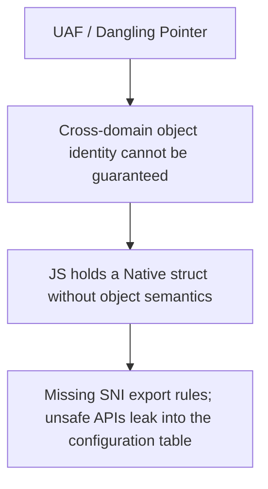

## Background

ElenixOS uses JerryScript as its application scripting engine, exposing system capabilities to the JavaScript side through the Script Native Interface (SNI). We built a code generation toolchain that automatically exports LVGL's C API as JavaScript-callable interfaces, which quickly gave us full UI control from the JS side.

But we soon ran into use-after-free issues.

## Derivation

The initial symptoms were straightforward: `lv_animimg_get_anim` returned an internal pointer to an animation object, and JS would crash after holding onto it.

The first instinct was a lifecycle management failure: the object was freed internally by LVGL without SNI notifying JS. Following this thread, we examined SNI's two existing lifecycle mechanisms.

Object tree nodes (`lv.obj`, `lv.button`) are managed through control blocks: the control block takes over the LVGL object's `user_data`, and the JS object holds the same control block via `native_ptr`. When LVGL deletes the object, it triggers `LV_EVENT_DELETE`; SNI sets `alive` to `false`, and subsequent accesses are rejected. Managed resources (`lv.timer`, `lv.style`) are created, held, and destroyed entirely by SNI, with their lifecycle fully under control.

But the pointer returned by `lv_animimg_get_anim` fits neither path. It is not a tree node, so there is no `user_data` to take over. It was not created by SNI, so there is no way to know when it will be destroyed. This line of reasoning dead-ends here: the issue is not a deficiency in the lifecycle mechanism, but rather that this category of object has no observable lifecycle boundary at all.

The investigation then turned to ownership semantics. JS holds a raw native pointer with no borrowing constraints and can access it at any time after Native has freed it. This sounds like a missing Borrow model. But this direction also hits a wall: a borrow model presupposes knowing when an object lives and dies, and we cannot even determine the lifecycle boundary. Without lifecycle information, borrowing has no foundation.

Next, we questioned whether SNI's object classification was too coarse. Control blocks cover only tree nodes, and managed resources use linked-list management. Could we add a third Handle type specifically for objects that are "held internally by LVGL and passively referenced by SNI"? A brief thought experiment revealed the fundamental difficulty: how would this new Handle perceive object destruction? Tree nodes rely on `LV_EVENT_DELETE`. Managed resources destroy themselves. For objects such as internal animations, draw task descriptors, and event descriptors, LVGL provides no generic destruction notification. Adding a Handle type merely shifts the problem one level down: you would need infrastructure capable of sensing the destruction of arbitrary LVGL internal objects, and such infrastructure simply does not exist within LVGL's architecture.

All of these paths were dead ends, which led us to consider a more radical approach: preventing JS from holding any native handles at all.

In UI programming, there are two fundamental paradigms.

:::note

- **Imperative UI**: The developer explicitly creates, updates, and destroys every interface object, deciding each step. SNI currently belongs to this paradigm: `new lv.obj(parent)`, `obj.setSize(100, 50)`, where JS code directly manipulates native controls.
- **Declarative UI**: The developer only describes what the interface should look like; the runtime engine computes the diff and performs the actual operations. The developer never touches native objects. React's JSX, Vue's templates, and SwiftUI all belong to this paradigm.

:::

Declarative UI is the natural extension of the "prevent JS from holding any native handles" idea. Build a virtual DOM layer; application code describes only the interface structure (`<button onClick={handler}>Click</button>`) without holding any native objects. The framework internally manages all object creation, updates, and destruction, with lifecycle entirely handled by the runtime engine. JS developers operate only on virtual nodes and never touch `lv_obj_t *` directly.

This path is architecturally clean: one could say it eliminates the problem rather than solving it. If the JS side never holds native pointers, where would UAF come from?

But pushing further, this approach does not truly eliminate the problem. A declarative framework shifts the burden of lifecycle management from the JS developer to the engine developer: it sidesteps the burden but does not remove it. The framework must still maintain the mapping between virtual DOM and real controls, perceive control creation and destruction, manage event callbacks, and handle consistency in asynchronous scenarios. On an MCU, a diff engine must also be added, introducing runtime overhead and memory usage we are unwilling to bear. More critically: this mechanism essentially rebuilds an object identity mapping on the C side, doing the same thing as control blocks, just one layer higher.

The same logic applies to compile-time solutions: compiling HTML/XML or JSX on the PC side into pure JS object descriptions, with minimal execution at runtime. Performance is not the issue, but the toolchain workload is substantial, and the divergence from the current imperative API surface is too large. More importantly, it architecturally sidesteps the same question rather than answering it: **can the JS side hold native objects in any form?**

At this point, we began to realize the direction might have been wrong from the start. Not because any particular solution was inadequate, but because the premise of the problem needed reexamination.

The code generation tool itself deserves recognition. It is not a fully automatic "syntax scanner" but a configuration-driven code generator. Its workflow is clear: a human maintains an API table (`api_table`) defining which classes exist and which method patterns to export; a human maintains a type classification table (`lv_types.json`) annotating each LVGL type as `handle_object`, `value_object`, or `primitive`; the generator reads these two configurations and automatically produces the corresponding C binding code. For complex interfaces that cannot be auto-generated, it also supports directly specifying hand-written wrapper functions in the configuration as replacements.

This design works perfectly for the LVGL widget layer. Types such as `lv_obj_t` and `lv_button_t` are annotated as `handle_object` in `lv_types.json`, and the generator produces control block binding code for them. Types such as `lv_style_t` and `lv_color_t` are annotated as `value_object`, and the generator produces value-copy code for them. Everything is deterministic and predictable.

The problem is not here. The problem is: **no one ever defined what qualifies to enter this API table and what does not.**

The API table is manually maintained, and the type classification table is also manually maintained. When a person fills in these configurations, there is no explicit rule telling them: is the pointer returned by this function safe on the JS side? Should this type be annotated as handle, value, or not appear in the configuration at all?

In other words, the configuration system is complete, but the configuration specification is absent. No document declares "SNI only exports APIs satisfying the following conditions," and no process performs a safety review when new configuration entries are added. Every developer adds entries to the table based on their own understanding. Some added `lv_animimg_get_anim` into the method matching patterns; some annotated `lv_anim_t` as `handle_object`. From the generator's perspective, these are all legitimate configuration inputs, and it faithfully executes them. But no one considered whether this path was safe on the JS side.

So the real problem is not that the generator "exports by syntax," but rather:

1. We never defined SNI's export boundary rules.
2. The configuration table expanded continuously without constraints, and internal pointers slipped into the export list.
3. The generator is merely a tool that faithfully executes configuration. It does not judge, nor should it judge, whether the configuration is reasonable.

LVGL is an ingeniously designed library. At the UI widget level, it implements a complete object-oriented style in C: `lv_obj_t` as a base class; `lv_button_t` and `lv_label_t` achieve inheritance through type casting; each widget has construction, destruction, property read/write, and event callbacks. These objects possess a stable identity, explicit ownership, and an observable lifetime. These three properties are referred to collectively as *object semantics* throughout this article. Annotating them as `handle_object` in `lv_types.json` causes the generator to automatically produce control block binding code, and the JS side receives a safe handle.

However, not all of LVGL's APIs are designed around long-lived objects. LVGL provides both object APIs and procedural resource APIs. Widget-layer functions such as `lv_obj_create` and `lv_obj_set_size` possess full object semantics, but another category of APIs is essentially a procedural resource management interface. Their parameters and return values are also struct pointers, yet they lack object semantics.

Consider `lv_anim_t` as an example. It is a configuration struct combined with runtime state and does not possess object semantics. You create an `lv_anim_t`, fill its fields (duration, start_value, end_value, exec_cb), and hand it to LVGL's animation system. LVGL internally holds this data and invokes the exec_cb in timer callbacks. When the animation ends, LVGL may or may not free it. There is no object handle to query "is the animation still alive," because that is not within its semantics.

Another typical example is `lv_draw_task_t`. It is a draw task descriptor rather than an independent object, and does not possess object semantics. The pointer obtained is only valid within the current callback; it points to the rendering context of the current frame, and that memory may be reclaimed or reused in the next frame.

These are not design flaws in LVGL. On the contrary, they demonstrate the LVGL developers' masterful use of C: applying object-oriented design where appropriate and procedural C idioms where appropriate. UI widgets need object semantics, so LVGL provides them. Internal resources and execution contexts do not, so LVGL handles them in the lightest possible way: struct allocation, on-demand passing, internal reclamation. This hybrid style is a key reason LVGL runs efficiently on MCUs.

But when a function like `lv_animimg_get_anim` is added to the API table's export rules, the configuration system does not reject it. `lv_anim_t *` has no clear classification in `lv_types.json`, or was casually annotated as `handle_object`. From a configuration standpoint, it is entirely legal, and the generator therefore faithfully produces control block binding code for it. The JS side receives a handle. The problem is not in the generator's logic but at the source of the configuration: **no rule prevents this function from entering the API table, and no check issues a warning after it has entered.**

In other words: the issue is not "these objects should not enter JS," but rather "when adding entries to the configuration table, no one asked whether the return value of this API is safe on the JS side." UI widgets work perfectly not because the generator is clever, but because their type classification in `lv_types.json` happens to be correct, and their API inclusion in `api_table` happens to be reasonable. Internal animation pointers cause problems because the same configuration table lacks a gate.

Thus, the real question is not "what should the generator do," but "what should SNI export." This is a boundary that was never formally defined. No document declares SNI's export admission rules, and no process conducts a safety review on configuration changes. The generator is a faithful executor. It does not judge, nor should it judge, whether the configuration is reasonable. The responsibility for judgment lies with the human, and we had not previously assumed it.

But this still leaves a more fundamental question unanswered: declarative UI insists on preventing JS from holding any native objects — why does this approach initially appear to be the most thorough solution?

Because what it attempts to eliminate is not use-after-free but the cross-language boundary itself. If the JS side only operates on a virtual DOM and never holds any `lv_obj_t *`, then concepts like identity, ownership, borrowing, and UAF do not need to exist. But tracing this reasoning to its conclusion reveals that it does not eliminate the problem; it merely shifts its bearer. The mapping from virtual DOM to real controls, synchronization of control creation and destruction, consistency of event callback bindings — someone must still guarantee all of these. This responsibility shifts from the JS developer to the UI Runtime engine developer. A declarative framework rebuilds an object identity mapping on the C side, doing essentially the same thing as control blocks, just one layer higher.

Pushing further, the conclusion becomes clearer: as long as LVGL runs on the C side and JS runs on the JerryScript side, object lifecycle consistency across the language boundary is an inescapable responsibility of SNI. The bearer can change — JS developer, declarative framework, or code generator — but the responsibility itself cannot be eliminated.

Of course, there is one approach that fundamentally bypasses the problem: abandon LVGL and implement a complete UI engine on the JS side, with object tree, layout, rendering, and event system all running inside JerryScript. This path would indeed eliminate cross-language pointer issues entirely, because cross-language pointers would not exist. But the cost is also obvious: running a pure JS UI engine on an MCU means object tree construction and traversal, recursive layout calculation, and per-frame dirty-region diffing all execute through interpretation rather than native code. The sheer task of "implementing a functionally equivalent LVGL" alone is sufficient to rule out this option.

So when we say "the object boundary was drawn wrong," it is not because no native objects should enter JS. Tree nodes and managed resources work well in the JS environment because their type classifications and API inclusions are reasonable. The APIs that break — internal animation pointers, event descriptors, draw tasks — break because the configuration table lacks the corresponding admission control.

From another perspective: use-after-free is not a lifecycle management failure, nor a generator design flaw. It is the **consequence of missing SNI export rules**. If clear rules defined what could and could not enter the configuration table, these problems would have been stopped the moment the configuration was written.

## Answer

Since the problem is the absence of SNI export rules, the answer is clear: **formally define SNI's export boundary and codify it in documentation and process.**

Specifically, two rules.

First, only types that possess a stable identity, a clear lifecycle boundary, and an observable destruction event are permitted to enter the API table and the `handle_object` classification in `lv_types.json`. All LVGL widget-layer objects naturally satisfy these three conditions; the status quo is maintained.

Second, structs that do not satisfy the above conditions — configuration structs, runtime state, internal execution contexts — are not permitted to be directly included. For functionality within them that genuinely needs to be exposed to the JS side, use manual wrappers: write wrapper functions that perform semantic translation on the C side before exposing them to JS. Raw struct pointers never leave the C layer.

The generator does not need its core logic changed. It is already a mature, configuration-driven tool. What is needed is to add an admission review layer at the generator's input — the API table and type classification table. Every newly added configuration entry must pass the review: "Is the pointer returned by this API safe on the JS side?"

Take animation as an example. `lv.anim` is created via `new`, fully managed by SNI through the managed resource path. It possesses object semantics and presents no problem. But the `lv_anim_t *` returned by `lv_animimg_get_anim` does not possess object semantics: it is merely a combination of configuration and state held internally by LVGL; its liveness cannot be queried because "querying whether the animation is alive" is not within its semantics. The fix is not to try to manage this pointer but to stop exporting this getter. Instead, provide a value-query function that reads the animation's current value, duration, and playback state on the C side, packages them into a pure data object, and returns it to JS. What the JS side receives is not a mapping of an LVGL native object, but a semantically translated UI Runtime interface.

## Export Boundary Rules

Once reexamined through the lens of lifecycle, the export boundary rules become clear: **the JS side may only receive objects whose lifecycle is verifiable; anything it cannot verify should not be exported.**

This rule naturally divides SNI's handle types into four categories, each with a completely different export strategy.

**Object tree nodes may be freely returned.** All `lv_obj_t` and its subclasses (`lv_button_t`, `lv_label_t`, etc.) natively possess the `LV_EVENT_DELETE` event, and the control block takes over the lifecycle via `user_data`. This safety guarantee does not depend on who created the object: any `lv_obj_t *`, whether returned by a constructor or by `lv_obj_get_parent()`, can be taken over by the control block. Therefore, getters on object tree nodes can be safely exported.

**Managed resources may only be returned from constructors.** For managed resources such as `lv_timer_t`, `lv_style_t`, and `lv_anim_t`, lifecycle safety is entirely predicated on the closed loop of "SNI creates it, tracks it, and destroys it." Allowing a non-constructor method to return a managed resource handle would mean SNI is making a lifecycle promise about an object it did not create — a promise it cannot fulfill. `lv_timer_get_next()` traverses LVGL's internal timer linked list; the next timer may not have been created by SNI. `lv_obj_get_style_anim()` returns an animation pointer from LVGL's internal state; the `lvgl_alive` flag does not exist for it. The sole safe exit for managed resources is the constructor.

**Types with no lifecycle boundary must never enter JS.** Internal pointers such as `lv_style_value_t *`, `lv_grad_dsc_t *`, and `lv_event_dsc_t *` lack object semantics, lack destruction notifications, and do not persist beyond a single frame at LVGL's API boundary. Annotating them as `handle_object` is a classification error. The correct approach is to explicitly mark them as non-exportable. If their functionality genuinely needs to be exposed, use manual wrappers: extract the needed fields on the C side and return them as value objects.

**Child resources may be returned, but both destruction paths must be covered.** Types such as `lv_chart_series_t *`, `lv_chart_cursor_t *`, and `lv_draw_buf_t *` are created by methods on a parent widget (e.g., `lv_chart_add_series`), can be independently destroyed (e.g., `lv_chart_remove_series`), and are cascade-destroyed when the parent widget is deleted. They differ from object tree nodes in one key respect: tree nodes have a single destruction path (`LV_EVENT_DELETE`), while child resources have two — the explicit destruction function and the parent's cascade destruction. SNI can intercept the former by marking the handle dead in a special wrapper for the remove method. For the latter, the parent's `LV_EVENT_DELETE` callback must traverse a child-handle linked list and mark all children dead uniformly. Once both paths are covered, child resources can be safely returned, because both their creation and destruction are within SNI's view; the current code simply misses the cascade-destruction path.

These four rules define hard boundaries on the generator's automatic bridging path. The manual wrapper channel remains open: if a managed resource API genuinely needs to be exported (for example, to iterate over a timer linked list), the developer can handle the lifecycle issue on the C side, write a manual wrapper function, and attach it to the class descriptor. The generator only enforces rules on the automatic path — it does not judge, nor does it substitute human judgment; it simply ensures that un-reviewed managed resources cannot enter the JS side through the automatic path.

Together, these four rules form a complete export boundary. Their core logic can be stated in a single sentence:

> SNI may only promise the JS side the safety it is capable of delivering. Object tree node safety comes from LVGL's own destruction notification, which everyone can trust. Managed resource safety comes from SNI's create-track-destroy closed loop, which only SNI can deliver, so only the construction path is authorized to make this promise. Internal descriptors have no safety at all, so no promise should be made. Child resource safety comes from SNI covering both destruction paths; creation and destruction are both visible, and once both paths are covered, return is safe.

## Future Direction

The managed resource model already reliably handles resources such as timers that are fully managed by SNI. The next step is to systematize the export boundary rules described above: annotate each handle type in `lv_types.json` with its lifecycle classification, add return-type admission checks to the code generator — rejecting managed resources returned from non-constructors and rejecting types with no lifecycle boundary. At the same time, the cascade-destruction issue for child resources must be fixed: in the parent's `LV_EVENT_DELETE` callback, traverse the child-handle linked list and mark all children dead. Audit the existing export table and remove unsafe entries.

## Conclusion

The ultimate conclusion of this derivation is not a choice of technical solution, but a correction of an architectural premise:

> SNI needs explicit export boundary rules, rather than allowing the API table and type classification table to expand without constraints.

LVGL's design is excellent: object-oriented in the widget layer, procedural C idioms in the resource interface layer. This is precisely what enables it to run efficiently on MCUs. The generator's design is also excellent: configuration-driven, type-classified, supporting manual wrapper substitution. It faithfully executes human intent. The problem lies in the gap between them: we never wrote a document declaring which APIs are eligible to enter the configuration table and which are not.

Using lifecycle verifiability as the criterion, the export boundary for SNI's handle types can be drawn naturally: object tree nodes may be freely returned; managed resources may only be returned from constructors; types with no lifecycle boundary are prohibited from entering; child resources may be returned once both destruction paths are covered. With a clear boundary, the generator can intercept unsafe exports at configuration time, rather than relying on developer vigilance at runtime.

Looking back over the entire derivation, a deeper recognition emerges: a code generator is responsible for automation; it faithfully translates configuration into code. But it cannot guarantee the correctness of the configuration itself. Automated tooling can ensure that "configuration becomes correct code," but it cannot ensure that "the configuration itself is correct." SNI's export boundary should not be determined by LVGL's type names, but by object semantics: when a type lacks a stable identity, explicit ownership, and an observable lifetime, it should not enter the JS side regardless of what it is called in C. The configuration table must not become an un-designed API collector. Automation can never replace abstraction.
