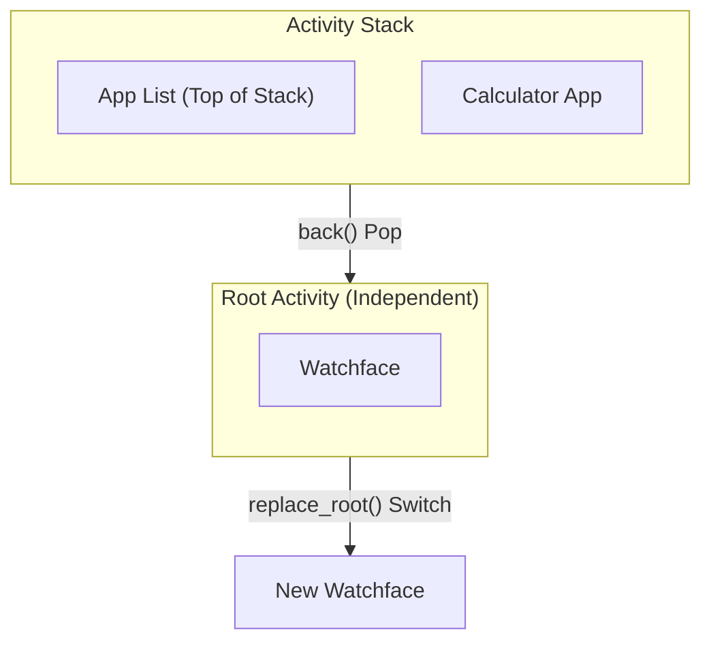

# Activity and View

Activity is the core component for managing pages and user interfaces in ElenixOS. Each Activity represents an independent screen page (such as application page, watchface page), containing an associated View and complete lifecycle management.

## Activity Overview

Activity is the core abstraction for page navigation and lifecycle management in ElenixOS. Each Activity contains:

- An associated **View** (LVGL object tree), which is the UI content of the page
- Complete **lifecycle callbacks** (enter, destroy, pause, resume)
- UI properties such as **title** and **title color**
- **Type** identifier (application, watchface, application list, etc.)
- **AppHeader** visibility control

### Activity Types

```c
typedef enum {
    EOS_ACTIVITY_TYPE_NULL = 0,            // Null type
    EOS_ACTIVITY_TYPE_APP,                 // Application page
    EOS_ACTIVITY_TYPE_APP_LIST,            // Application list
    EOS_ACTIVITY_TYPE_WATCHFACE,           // Watchface page
    EOS_ACTIVITY_TYPE_WATCHFACE_LIST,      // Watchface list
    EOS_ACTIVITY_TYPE_COUNT
} eos_activity_type_t;
```

## Lifecycle

Activity has a complete lifecycle managed by the following callback functions:

```c
typedef struct {
    eos_activity_on_enter_t on_enter;      // Called when entering
    eos_activity_on_destroy_t on_destroy;  // Called when destroying
    eos_activity_on_pause_t on_pause;      // Called when pausing
    eos_activity_on_resume_t on_resume;    // Called when resuming
} eos_activity_lifecycle_t;
```

### Lifecycle Flow

```
Create Activity (eos_activity_create)
    │
    ▼
Enter Activity (eos_activity_enter)
    │
    ├── on_enter()  ── Enter callback
    │
    ▼
Activity visible (visible)
    │
    ├── on_resume()  ── Resume callback (when returning from other Activity)
    │
    ▼
Leave Activity
    │
    ├── on_pause()  ── Pause callback (when switching to other Activity)
    │
    ▼
Return Activity ──► on_resume()
    │
    ▼
Destroy Activity (eos_activity_back)
    │
    └── on_destroy() ── Destroy callback
```

### Lifecycle Callback Description

| Callback | Trigger Condition | Typical Use Case |
|----------|-------------------|------------------|
| `on_enter` | When Activity first displays | Initialize UI, load data |
| `on_resume` | When returning from other Activity | Refresh data, resume animations |
| `on_pause` | When switching to other Activity | Save state, pause animations |
| `on_destroy` | When Activity is destroyed | Release resources, unsubscribe |

## Activity Stack Management

ElenixOS uses a stack structure to manage Activities. The watchface (Watchface) Activity is fixed at the bottom of the stack, and newly opened Activities are pushed to the top of the stack.

### Root Activity Mechanism

**Important Concept**: The watchface serves as the **Root Activity**, managed independently of the Activity stack and has a special status:



**Root Activity Characteristics**:

| Feature | Normal Activity | Root Activity |
|---------|----------------|---------------|
| **Location** | In stack | Independent of stack |
| **Lifecycle** | Created/destroyed with push/pop | Persists until switched |
| **Creation** | `eos_activity_create()` | `eos_activity_create_root()` |
| **View Creation** | Lazy creation (in on_enter) | **Immediate creation** (at create_root) |
| **Pop Effect** | Destroyed and released | Not affected by pop |
| **Switch Method** | N/A | `eos_activity_replace_root()` |

**Root Activity Use Cases**:
- Watchfaces (built-in or JS)
- Serves as the system's "home page", always present
- Switched via `replace_root()` instead of push/pop

### Stack Structure Diagram

```
Top of Stack
      ┌──────────────────┐
      │  Activity C      │  ← Currently visible Activity
      ├──────────────────┤
      │  Activity B      │  ← Paused state
      ├──────────────────┤
      │  Activity A      │  ← Paused state
      └──────────────────┘
           │
           │ (Independent of stack)
           ▼
     ┌─────────────┐
     │  Watchface  │  ← Root Activity (Always present)
     └─────────────┘
```

### Navigation Operations

#### Enter New Activity

```c
eos_activity_enter(activity);
```

Pushes the Activity onto the stack and displays it. The previous Activity automatically enters the paused state.

#### Return to Previous Activity

```c
eos_result_t ret = eos_activity_back();
```

Destroys the current top Activity and resumes the previous one. Returns `EOS_OK` on success.

#### Return to Watchface

```c
eos_result_t ret = eos_activity_back_to_watchface();
```

Destroys all Activities in the stack and returns directly to the watchface.

#### Return in Event Callback

```c
void eos_activity_back_cb(lv_event_t *e);
```

Convenient wrapper for use in LVGL event callbacks.

## Interface Responsibilities and Usage Boundaries

The Activity interfaces are divided into four groups: controller initialization and Root management, normal Activity creation and destruction, current page and transition state queries, and View/title/AppHeader/snapshot property management. They operate on objects owned by the Activity controller and do not change the ownership of SPM programs or SNI resources.

Creating a Root Activity immediately establishes its View; normal Activities typically bind their View during the enter lifecycle. Explicit destruction applies only to temporary Activities not in the stack. The current page, the fully displayed page, and the page in transition must be distinguished through different query semantics; a single "current pointer" cannot represent all states.

Activity types are used to select page transitions and identify page purposes; title, AppHeader, and snapshots are page presentation properties. Snapshots can serve page transitions or Recent Apps, but snapshot buffers do not own the Activity View. Transition callbacks use animation groups to coordinate multiple objects, with completion and cleanup managed uniformly by the group.

Application development only needs to rely on the interface reference generated from documentation to confirm specific signatures; this page only specifies call timing, object ownership, lifecycle restrictions, and error boundaries.

## View and AppHeader Usage Boundaries

View is the root of the LVGL object tree owned by the Activity. It is created and bound when the page enters, and released uniformly by the Activity lifecycle when the page is destroyed. Page code can use LVGL for layout but should not replace the View currently held by the controller, nor should it delete objects still managed by the Activity when the page leaves.

AppHeader is a system-managed page header. Its visibility, title, and transitions should be coordinated with the system header manager through Activity properties; pages should not directly change the Z-order of the top-level Overlay. The title bar and page content should be updated within the same page state transition.

Specific function signatures, parameters, and return values for application development are provided by the auto-generated API reference. This page only documents View ownership, AppHeader hierarchy, enter/leave timing, and restrictions during page transitions.

## Activity and Event System

The Activity system is tightly integrated with the [Event System](/docs/architecture/kernel/event/events). When Activity page switching is complete, the `EOS_EVENT_ACTIVITY_SCREEN_SWITCHED` event is broadcast:

```c
// Listen for page switch complete event
eos_event_add_cb(some_obj, my_cb, EOS_EVENT_ACTIVITY_SCREEN_SWITCHED, NULL);

static void my_cb(lv_event_t *e) {
    lv_obj_t *current_view = lv_event_get_param(e);
    // Page switch complete, current_view is the View of current page
}
```

## Activity System Initialization Flow

```
System Startup
    │
    ▼
eos_activity_controller_init(watchface_activity)
    │
    ├── Create Activity stack
    ├── Get root screen
    ├── Set watchface Activity as current
    └── Call on_enter()
    │
    ▼
eos_app_header_init()
    │
    ├── Create AppHeader UI
    └── Place in lv_layer_top() layer
    │
    ▼
System Running
```

## Error Handling

| Condition | Return Value |
|-----------|--------------|
| Activity controller not initialized | Function returns `EOS_FAILED` |
| NULL Activity passed | Function checks internally and returns directly |
| Activity stack is empty | `eos_activity_get_current` returns NULL |
| Transition animation in progress | `eos_activity_is_transition_in_progress` returns true |

## Current Activity Interface Boundaries

### Creation and Destruction

- `eos_activity_create` creates a normal Activity; the View is typically bound in `on_enter`.
- `eos_activity_create_root` creates a Root Activity and immediately establishes its View, suitable for watchfaces.
- `eos_activity_destroy` is only for Activities not in the Activity stack; it cannot be used for currently visible, in-stack, or parked Activities.
- Controller initialization accepts a Root Activity; the Root Activity is not destroyed by normal back operations.

### Query Interfaces

Page query interfaces are used to distinguish navigation contexts. During transitions, do not treat the current navigation object as a fully displayed page; use dedicated transition state queries when animation status needs to be determined.

### View, Title, and Animation

View reading and binding should only be performed during lifecycle-allowed phases. Title, title color, page type, and AppHeader visibility are all Activity properties. Page transition callbacks receive an animation group; multiple related animations should be added to the same group, with completion and cleanup managed uniformly by the group.

## Activity Sub-stack in Recent Apps

When suspended, the app's Root Activity and its child Activities are detached from the current stack, and Views are moved to an invisible Parking Lot; Activity objects and Views remain valid. On resume, the saved sub-stack is reattached, the visible Activity is updated, and then a snapshot transition is performed.

Therefore, `on_pause` indicates temporary invisibility, not that resources are invalid; `on_destroy` indicates that the Activity will not be resumed. The package ID of an App Activity must be stable so that Recent Apps, uninstallation, and engine reset cleanup can find the corresponding objects.