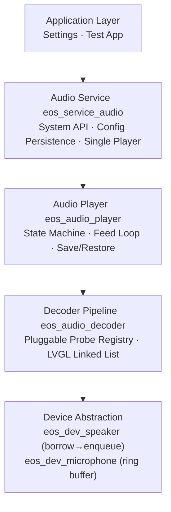
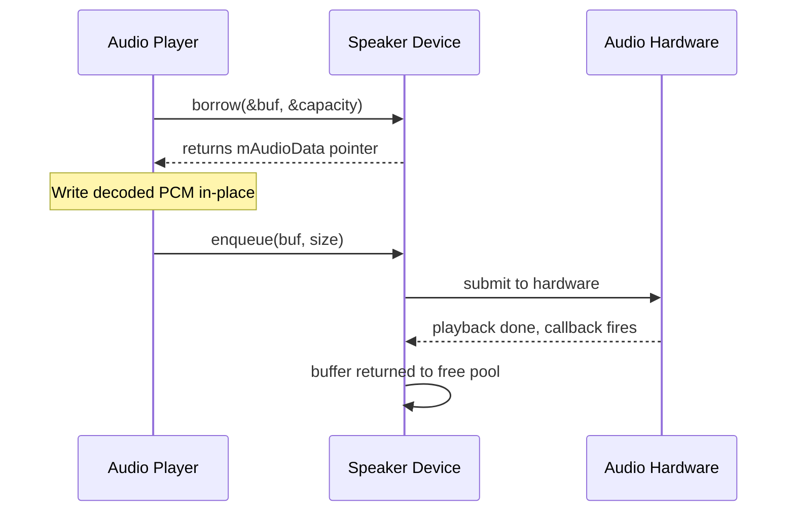
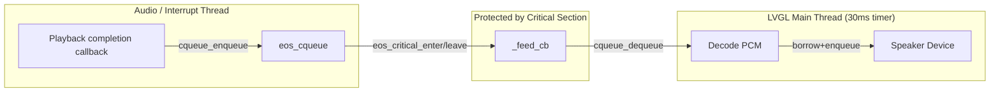
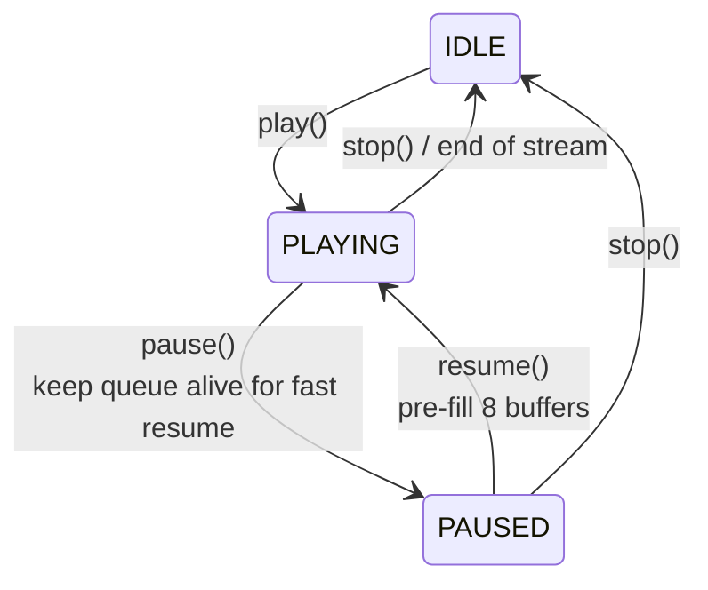
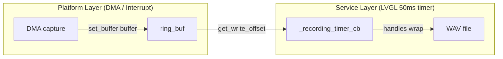

The ElenixOS audio subsystem uses a four-layer architecture. Each layer has a clear responsibility and is replaceable through its interface:



The service manages a single player instance internally, exposed through the service API. For advanced operations (e.g., querying `current_sample` for a progress bar), grab the pointer via `eos_service_audio_get_player()`. Prefer the service-layer functions for normal use.

## Speaker: Borrow-Enqueue Zero-Copy

We designed the borrow-enqueue pattern to eliminate inter-layer copies. The platform maintains an internal buffer pool; the player writes decoded PCM directly into platform-owned memory:



`enqueue` has a critical side-effect: if the speaker is in `DEV_STATE_READY` (registered but not started), the first `enqueue` automatically starts the hardware, transitioning to `PLAYING`. You must replicate this behavior when porting.

## ISR Safety: cqueue + Critical Section

The playback completion callback (or DMA interrupt) runs on the audio/interrupt thread. We use `eos_cqueue` (a lock-free circular queue) + `eos_critical_enter/leave` to hand buffers between the audio thread and the main LVGL thread:



When porting, you must ensure thread safety between `borrow` (called from the consumer thread) and the callback/interrupt that feeds buffers back.

## Mute: Zero-Fill, Not Volume=0

A common misconception: mute does **not** call `set_volume(0)`. `eos_service_audio_set_mute` only writes the flag to config and sets `p->muted = true`. Inside the fill loop:

```c
if (p->muted) {
    memset(buf, 0, cap);
    spk->ops->enqueue(buf, cap);
    return true;
}
```

This means the volume level is preserved while muted — you can adjust volume independently and it takes effect immediately on unmute.

## Volume: Two-Phase Commit

We split volume setting into two steps to support fade-in/fade-out and batch updates:

- `eos_audio_player_set_volume(n)` — writes `p->volume` only, no hardware access
- `eos_audio_player_apply_volume(p)` — pushes the internal value to the speaker's `set_volume` callback

`eos_service_audio_set_volume` wraps both. If you need to ramp volume smoothly, call `set_volume` multiple times then `apply_volume` once.

Volume is persisted via `eos_config` to `EOS_CONFIG_KEY_SPEAKER_VOLUME_NUMBER` (default 50); mute state to `EOS_CONFIG_KEY_MUTE_BOOL`.

## State Machine & Feed Loop



`play()` execution pipeline:
1. Automatically `stop`s any active playback
2. Opens the decoder (iterates the probe chain)
3. Opens the speaker device and applies volume
4. Pre-fills 8 buffers (prevents underrun at start)
5. Creates the feed timer (30ms period)

`_feed_cb` fills **as many buffers as possible** per tick using a `while` loop until `borrow` returns -1. `resume()` also pre-fills 8 buffers before resuming the hardware.

## Decoder Pipeline

Decoders are maintained in an LVGL linked list, probed in registration order. `eos_audio_decoder_open` iterates the list calling each `probe_cb`; the first match wins.

Built-in decoders:

| Decoder | Formats | Source |
|---------|---------|--------|
| WAV | 16-bit PCM RIFF/WAVE | `src/services/audio/decoders/eos_audio_decoder_wav.c` |

`probe_cb` inspects without holding resources — the WAV decoder opens the file, reads the RIFF header, scans for the `fmt` chunk, parses format, then closes. Real resource allocation happens in `open_cb`.

Adding a new decoder:

```c
eos_audio_decoder_t *dec = eos_audio_decoder_create();
eos_audio_decoder_set_probe_cb(dec, my_probe);
eos_audio_decoder_set_open_cb(dec, my_open);
eos_audio_decoder_set_read_cb(dec, my_read);
eos_audio_decoder_set_close_cb(dec, my_close);
eos_audio_decoder_set_seek_cb(dec, my_seek);  // optional
dec->name = "MyDecoder";
```

Seek uses a two-phase fallback: if the decoder provides `seek_cb`, call it directly; otherwise close + reopen the decoder and read-and-discard `sample * bytes_per_frame` bytes in 512-frame-aligned chunks (minimum 1024 bytes). This ensures streaming decoders without random access can still seek.

## Recording: Double Ring Buffer

Two independent pieces of code handle ring-buffer wrap-around on the recording path:



Recording parameters are fixed at 16kHz, mono, 16-bit. Output is standard RIFF/WAV: a 44-byte header is written at start (size fields set to zero), patched with correct values on `stop_recording`.

## Device Abstraction

### Speaker

```c
typedef struct {
    int  (*init)(void);
    int  (*deinit)(void);
    int  (*open)(uint32_t sample_rate, uint8_t channels, uint8_t bits_per_sample);
    int  (*borrow)(void **p_buf, uint32_t *p_capacity);
    int  (*enqueue)(void *buf, uint32_t size);
    int  (*stop)(void);
    int  (*pause)(void);
    int  (*resume)(void);
    int  (*set_volume)(uint8_t volume);
    bool (*is_available)(void);
} eos_dev_speaker_ops_t;
```

`eos_dev_speaker_register` validates only the six required pointers: `open`, `borrow`, `enqueue`, `stop`, `set_volume`, `is_available`; `init`/`deinit`/`pause`/`resume` are optional. Registration is one-shot; duplicates return `EOS_ERR_ALREADY_EXISTS`.

### Microphone

```c
typedef struct {
    int  (*init)(void);                                        // Optional
    int  (*deinit)(void);                                      // Optional
    int  (*open)(uint32_t sample_rate, uint8_t channels,
                 uint8_t bits_per_sample);                     // Required
    int  (*close)(void);                                       // Required
    int  (*start)(void);                                       // Required
    int  (*stop)(void);                                        // Required
    int  (*set_gain)(uint8_t gain);                            // Optional
    bool (*is_available)(void);                                // Required
    int  (*set_buffer)(uint8_t *buf, uint32_t size);           // Required
    uint32_t (*get_write_offset)(void);                        // Required
} eos_dev_microphone_ops_t;
```

`set_buffer` registers a ring buffer that DMA writes into (power-of-2 size recommended). `get_write_offset` must be thread-safe, callable from any context.

### enqueue Alignment

`enqueue` requires `size` to be frame-aligned — the platform layer should validate that `size` is a multiple of `bytes_per_frame`, and may silently truncate or return an error on misalignment. Each platform decides its own strategy.

## Save/Restore (Interrupt-Resume Pattern)

For temporary interruptions like incoming calls:

```c
// Interrupt — ownership transfers to caller
void *saved_src;
eos_audio_src_type_t saved_type;
uint32_t saved_pos;
eos_audio_player_save_state(&player, &saved_src, &saved_type, &saved_pos);
// player has forgotten saved_src; you must free() it later

// Restore — player must be in IDLE
eos_audio_player_restore_state(&player, saved_src, saved_type, saved_pos);
// internally calls play() then seek(position)
```

`save_state` **transfers ownership** of `p->cached_src` (a `strdup`'d string) to you. The implementation assumes `cached_src` comes from `strdup` — verify behavior if you use other source types.


## Complete Playback Data Flow

```mermaid
sequenceDiagram
    participant APP as Application
    participant SRV as Audio Service
    participant PLR as Audio Player
    participant DEC as Decoder
    participant SPK as Speaker Device

    APP->>SRV: play("/fs/music.mp3")
    SRV->>SRV: check speaker is_available()
    SRV->>PLR: play(src, EOS_AUDIO_SRC_FILE)
    
    PLR->>DEC: eos_audio_decoder_open(&dsc, src, EOS_AUDIO_SRC_FILE)
    DEC->>DEC: iterate probe chain
    Note over DEC: Each decoder's probe_cb gets a turn; the first to return EOS_OK wins
    
    PLR->>SPK: open(sample_rate, channels, bits)
    Note over SPK: Platform allocates hardware buffers
    
    PLR->>SPK: set_volume(volume)
    
    loop Pre-fill 8 buffers
        PLR->>SPK: borrow(&buf, &cap)
        PLR->>DEC: read(buf, cap)
        PLR->>SPK: enqueue(buf, read)
        Note over SPK: First enqueue starts hardware automatically
    end
    
    Note over PLR: Feed timer starts (30ms)
    
    loop Each tick (while borrow succeeds)
        PLR->>SPK: borrow(&buf, &cap)
        alt muted
            PLR->>PLR: memset(buf, 0)
        else
            PLR->>DEC: read(buf, cap)
        end
        PLR->>SPK: enqueue(buf, read)
    end
    
    Note over PLR: current_sample ≥ total_samples
    PLR->>PLR: done_callback → stop_internal
    SRV-->>APP: EOS_OK
```

## Notes

- The service exposes a single player instance `_player_media`. `eos_service_audio_get_player()` returns the internal pointer for advanced use (e.g., progress tracking), but the header recommends using the service-layer functions to avoid corrupting internal state.
- `eos_service_audio_play_tone` is stubbed, returns `EOS_ERR_DEV_OPS_NOT_SUPPORTED`. A future implementation could synthesize PCM directly and push it through the player.
- Recording parameters are hardcoded at 16kHz mono 16-bit, not configurable at runtime. Extending this requires adding parameter plumbing through the service layer.
- `save_state` / `restore_state` assumes `cached_src` originates from `strdup`. Verify correctness if you pass other source types.
- Additional player APIs: `eos_audio_player_seek(p, sample)` seeks during play/pause; `eos_audio_player_get_position(p)` / `eos_audio_player_get_duration(p)` track progress; `eos_audio_player_get_sample_rate(p)` returns sample rate; `eos_audio_player_set_done_callback(p, cb, ud)` registers a completion callback. Access these via the pointer from `eos_service_audio_get_player()`.
- Two file I/O interfaces exist: the **WAV decoder** uses `eos_fs_*` (`eos_fs_port.h` — low-level FS port), while the **recording code** uses `eos_storage_*` (`eos_service_storage.h` — storage service wrapper). Both eventually route to `eos_fs_port`, but the storage layer adds path validation and the Deferred File Writer (DFW) on top.
