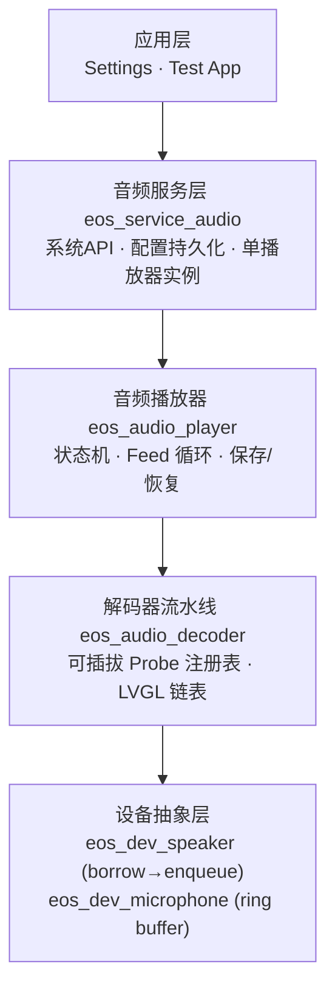
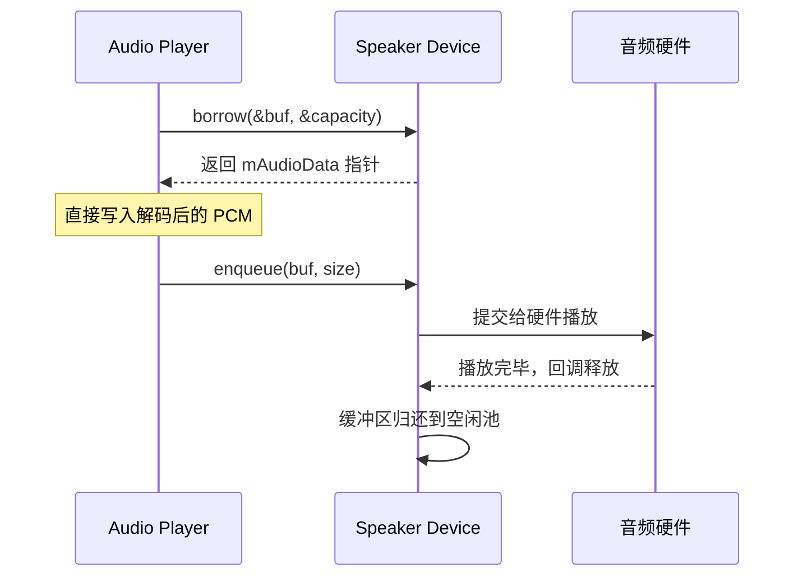
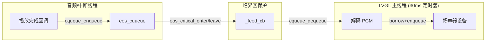
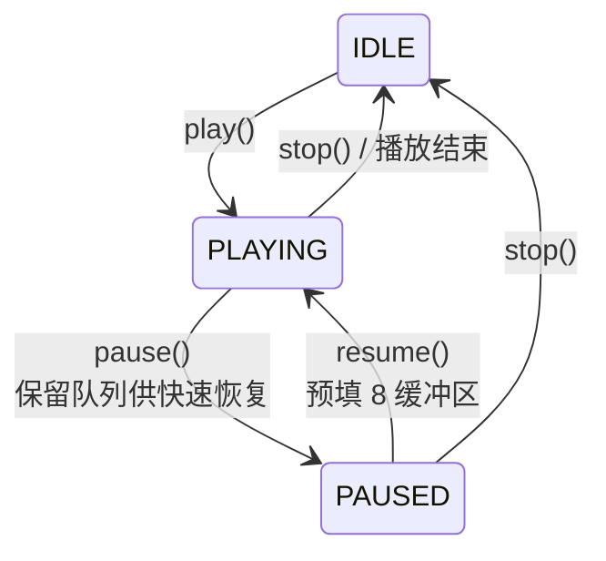
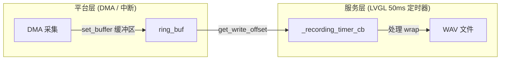
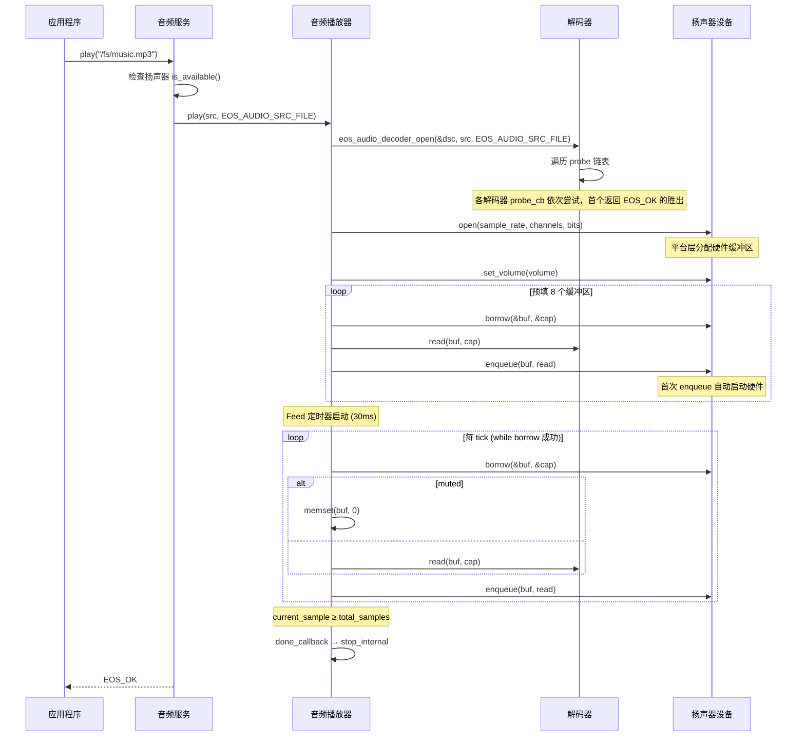

ElenixOS 音频子系统采用四层分层架构，每层职责清晰、可通过接口替换：



服务层只管理一个播放器实例，通过服务 API 控制。若需要同时操作播放器内部状态（如获取当前播放位置），通过 `eos_service_audio_get_player()` 拿到指针后直接操作；但建议优先使用服务层函数。

## 扬声器: Borrow-Enqueue 零拷贝

我们设计了 borrow-enqueue 模式来消除层间拷贝。平台维护一个内部音频缓冲池，播放器写入解码后的 PCM 时不经过 memcpy：



`enqueue` 隐含一个关键行为：若扬声器处于 `DEV_STATE_READY`（已注册但未启动），首次 `enqueue` 会自动启动硬件，将状态推进到 `PLAYING`。移植时务必实现此语义。

## ISR 安全: cqueue + 临界区

播放完成回调（或 DMA 中断）运行在音频/中断线程上。使用 `eos_cqueue`（无锁循环队列）和 `eos_critical_enter/leave` 在音频线程和主 LVGL 线程之间传递缓冲区：



不再区分"可选"与"必需"，移植时必须保证 `borrow`（消费者线程）和 `enqueue`（音频中断回调）之间的线程安全性。

## 静音: 全零填充，而非 Volume 置零

一个容易误解的设计：静音并不调用扬声器的 `set_volume(0)`。`eos_service_audio_set_mute` 只写入配置并设置播放器的 `muted` 标志。播放循环中：

```c
if (p->muted) {
    memset(buf, 0, cap);
    spk->ops->enqueue(buf, cap);
    return true;
}
```

这意味着静音状态下音量值保持不变，可以在静音时独立调整音量，取消静音后直接生效。

## 音量: 二阶段提交

我们将音量设置拆为两步，目的是支持淡入淡出等场景：

* `eos_audio_player_set_volume(n)` — 仅写入 `p->volume`，不触及硬件
* `eos_audio_player_apply_volume(p)` — 将内部值推送到扬声器的 `set_volume` 回调

`eos_service_audio_set_volume` 封装了两步。若你需要在播放过程中逐帧调整音量而不频繁操作硬件，可以自己控制调用时机。

音量值通过 `eos_config` 持久化到 `EOS_CONFIG_KEY_SPEAKER_VOLUME_NUMBER`（默认 50），静音状态持久化到 `EOS_CONFIG_KEY_MUTE_BOOL`。

## 状态机与 Feed 循环



`play()` 执行流水线：

1. 自动 `stop` 任何正在进行的播放
2. 打开解码器（遍历 probe 链表）
3. 打开扬声器设备，应用当前音量
4. 预填 8 个缓冲区（防止启动时欠载）
5. 创建 Feed 定时器（周期 30ms）

`_feed_cb` 在每次定时器滴答时用 `while` 循环尽可能多地填充缓冲区，直到 `borrow` 返回 -1（无空闲缓冲区）。这意味着一个 tick 可以填满多个缓冲区，取决于解码和硬件速度。`resume()` 也会先预填 8 个缓冲区再恢复硬件。

## 解码器流水线

解码器通过 LVGL 链表维护，按注册顺序探测。`eos_audio_decoder_open` 遍历链表依次调用 `probe_cb`，首个返回 `EOS_OK` 的胜出。

内置解码器：

| 解码器 | 支持格式                 | 源码位置                                                  |
| --- | -------------------- | ----------------------------------------------------- |
| WAV | 16-bit PCM RIFF/WAVE | `src/services/audio/decoders/eos_audio_decoder_wav.c` |

`probe_cb` 只探测不持有资源——以 WAV 解码器为例：打开文件读取 RIFF 头，验证 `RIFF` + `WAVE`，扫描 `fmt`  chunk 解析格式，然后关闭文件。真正的资源分配在 `open_cb` 中。

添加一个新解码器：

```c
eos_audio_decoder_t *dec = eos_audio_decoder_create();
eos_audio_decoder_set_probe_cb(dec, my_probe);
eos_audio_decoder_set_open_cb(dec, my_open);
eos_audio_decoder_set_read_cb(dec, my_read);
eos_audio_decoder_set_close_cb(dec, my_close);
eos_audio_decoder_set_seek_cb(dec, my_seek);  // 可选
dec->name = "MyDecoder";
```

seek 操作有两阶段回退：若解码器提供 `seek_cb`，直接调用；否则关闭重开解码器，以 512 帧对齐的 chunk（最小 1024 字节）读取并丢弃 `sample * bytes_per_frame` 字节。这确保了不支持随机访问的流式解码器也能 seek。

## 录制: 双重环形缓冲区

录制链路上有两个独立处理环形缓冲区回绕的逻辑：



录制参数固定为 16kHz、单声道、16-bit。输出为标准 RIFF/WAV，44 字节头部在开始时写入（size 字段占位为零），`stop_recording` 时回填正确值。

## 设备抽象

### 扬声器

```c
typedef struct {
    int  (*init)(void);
    int  (*deinit)(void);
    int  (*open)(uint32_t sample_rate, uint8_t channels, uint8_t bits_per_sample);
    int  (*borrow)(void **p_buf, uint32_t *p_capacity);
    int  (*enqueue)(void *buf, uint32_t size);
    int  (*stop)(void);
    int  (*pause)(void);
    int  (*resume)(void);
    int  (*set_volume)(uint8_t volume);
    bool (*is_available)(void);
} eos_dev_speaker_ops_t;
```

`eos_dev_speaker_register` 仅校验 `open`、`borrow`、`enqueue`、`stop`、`set_volume`、`is_available` 六个必需指针；`init`/`deinit`/`pause`/`resume` 可选。仅可注册一次，重复返回 `EOS_ERR_ALREADY_EXISTS`。

### 麦克风

```c
typedef struct {
    int  (*init)(void);                                        // 可选
    int  (*deinit)(void);                                      // 可选
    int  (*open)(uint32_t sample_rate, uint8_t channels,
                 uint8_t bits_per_sample);                     // 必需
    int  (*close)(void);                                       // 必需
    int  (*start)(void);                                       // 必需
    int  (*stop)(void);                                        // 必需
    int  (*set_gain)(uint8_t gain);                            // 可选
    bool (*is_available)(void);                                // 必需
    int  (*set_buffer)(uint8_t *buf, uint32_t size);           // 必需
    uint32_t (*get_write_offset)(void);                        // 必需
} eos_dev_microphone_ops_t;
```

`set_buffer` 注册一个由 DMA 写入的环形缓冲区（建议大小为 2 的幂）。`get_write_offset` 必须线程安全，可从任何上下文调用。

### enqueue 对齐约束

`enqueue` 的 `size` 应为帧对齐——平台层应在实现中校验 `size` 是否为 `bytes_per_frame` 的整数倍，不对齐时可选择静默截断或返回错误。各平台自行决定处理策略。

## 保存/恢复（来电中断模式）

用于电话呼入等场景的临时中断：

```c
// 中断——所有权转移给调用者
void *saved_src;
eos_audio_src_type_t saved_type;
uint32_t saved_pos;
eos_audio_player_save_state(&player, &saved_src, &saved_type, &saved_pos);
// 此时 player 遗忘 saved_src，你负责在适当时 free 它

// 恢复——player 必须在 IDLE 状态
eos_audio_player_restore_state(&player, saved_src, saved_type, saved_pos);
// 内部调用 play() 再 seek(position)
```

`save_state` 将 `p->cached_src`（`strdup` 得到的字符串）的所有权转移给你。实现假定 `cached_src` 是 `strdup` 出来的——若使用其他源类型，请自行验证。

## 完整数据流: 播放



## 注意

* 服务层目前只暴露一个播放器实例 `_player_media`。`eos_service_audio_get_player()` 返回内部指针供进阶使用，但头文件注释建议优先使用服务层 API，避免破坏内部状态机。
* `eos_service_audio_play_tone` 尚未实现，目前返回 `EOS_ERR_DEV_OPS_NOT_SUPPORTED`。后续可考虑通过合成 PCM 数据直接推送到播放器。
* 录制参数硬编码为 16kHz 单声道 16-bit，运行时不可修改。若需支持其他格式，需在服务层增加参数传递。
* 播放器的 `save_state` / `restore_state` 假定 `cached_src` 源自 `strdup`。若传入其他类型的源，需要自行验证行为正确性。
* 播放器额外提供了以下进阶 API：`eos_audio_player_seek(p, sample)` 在播放/暂停中跳转；`eos_audio_player_get_position(p)` / `eos_audio_player_get_duration(p)` 获取进度；`eos_audio_player_get_sample_rate(p)` 获取采样率；`eos_audio_player_set_done_callback(p, cb, ud)` 注册播放结束回调。这些函数通过 `eos_service_audio_get_player()` 拿到指针后使用。
* 文件 I/O 有两套接口：**WAV 解码器** 使用 `eos_fs_*`（`eos_fs_port.h` 底层文件系统端口），而 **录制代码** 使用 `eos_storage_*`（`eos_service_storage.h` 存储服务封装）。两者最终都路由到 `eos_fs_port`，但存储服务层额外提供了路径验证和延迟写入器（DFW）功能。
